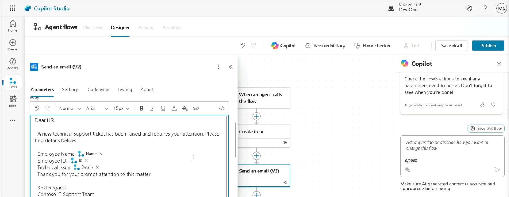

# Project 1 Lab Guide: Smart IT Helpdesk Agent for Employee Self-Service 

***Scenario:** Smart IT Helpdesk Agent*  
***Version**: 25 June, 2025*  
***Estimated Time:** 120–140 minutes*   
***Platform:** Microsoft Copilot Studio + Microsoft Teams + Power
Automate*

# Introduction

The **Contoso IT Assistant** is a virtual support agent built using
Microsoft Copilot Studio. It helps employees quickly resolve common IT
issues, such as password resets, VPN access, software installation, and
connectivity troubleshooting.

Available 24/7 in Microsoft Teams, the assistant empowers users with
self-service options and automates routine support tasks, reducing wait
times and IT workload.

# Objectives

Build a Copilot Studio agent that can: 

1.  Help employees reset passwords 

2.  Request VPN or software access 

3.  Escalate unresolved issues to human IT support 

4.  Be deployed on Microsoft Teams  

# Pre-Requisites 

1.  Access to Microsoft Copilot Studio 

2.  A Microsoft 365 tenant with Teams and SharePoint 

3.  Power Automate access with basic flow permissions 

# Architecture Diagram

# Key Personas

**Olivia Chen**

- *Role:* (Not specified)

- *Goals:* Improve ticket response times, reduce manual workload

- *Pain Points:* High number of simple repetitive tickets; SLA breaches

**Diego Morales**

- *Role:* Employee (Sales Division)

- *Goals:* Quickly reset password and request VPN access

- *Pain Points:* Waiting 24–48 hours for basic IT help

**Priya Nair**

- *Role:* IT Business Analyst

- *Goals:* Implement user-friendly IT automation solutions

- *Pain Points:* Poor user experience with current helpdesk portal

**YOU (Learner)**

- *Role:* Agent Developer (Contoso IT Team)

- *Goals:* Build and deploy a smart, scalable, self-service agent

- *Pain Points:* Must balance functionality, governance, and usability

# Step-by-Step Instructions 

# Exercise 1: Creating the Contoso IT Assistant Agent

This exercise focuses on logging into Microsoft Copilot Studio and
creating a customized Copilot agent tailored for IT support operations
at Contoso. Participants will gain hands-on experience navigating
Copilot Studio, configuring environments, and building an AI-powered
agent to streamline IT workflows.

## Task 1: Creating and Configuring Contoso IT Assistant Agent

1.  Open Copilot Studio Home Page

> **Click or visit:**
>
> https://copilotstudio.microsoft.com/environments/4a73a65a-10b9-e7a3-aceb-bb9044566c00/home

2.  **Sign In**

Use your Microsoft admin credentials to log in securely.

3.  **Select Region**

> When prompted, choose United States as your region, then click Next. 

4.  Skip Configuration (if prompted) On the configuration screen, click
    Next and then Skip to proceed without custom setup.

5.  Navigate to the Dev One Environment Once logged in successfully,
    look at the top-right corner or the environment selector, and switch
    to the “Dev one” environment to start building or managing your
    agents.

6.  Select **“Create”** 🡪 Choose **New Agent**.

7.  From top right corner of the agent creation window, click on **Skip
    to configure**.

8.  Enter **Name, Description and Instruction** of the agent as give
    below and click on **Create** button.

**Name:** Contoso IT Assistant

**Description:** Create an IT support agent that helps users reset
passwords, request VPN access, and software installation

**Instructions:**

1.  Create the IT Support Copilot Agent

2.  Create Topics for Common IT Issues: Password Reset, Request VPN
    Access, Install Software

3.  Add Ticket Logging via Power Automate

4.  Add Plugin in Copilot Studio

5.  Test the Agent

6.  Publish and Deploy

9.  Do the following Agent settings: On overview page of **Contoso IT
    Assistant**

    - **Enable:** the orchestrator for the agent.

    - **Disable** the **Allow the AI to use its own general
      knowledge** option.

10. After making all necessary settings, click **Save**

11. From top right corner of the agent, click on
    the **Settings** button.

12. Go to Generative AI section, select the Generative AI (Preview), set
    content moderation as **Medium** and click on **Save** to save the
    setting.

**Conclusion**

By completing this exercise, participants will learn:

1.  How to access and set up Microsoft Copilot Studio.

2.  Steps to create and configure a custom Copilot agent.

3.  Practical skills in enabling generative AI and orchestrator settings

**Note:** The agent is now named "Contoso IT Assistant" and is set up to
help users with password resets, VPN access requests, and software
installations.

## Task 2: Add Knowledge Base to the Agent

1.  On Contoso agent overview page, scroll down and click on + Add
    Knowledge button.

2.  Select Click to browse button to add the lab file Contoso IT Support
    Issue from your local system and then click on Add to save the file.

# Exercise 2: Getting Started with SharePoint Site

Get started with setting up your SharePoint site for collaboration and
information sharing. This guide also walks you through creating a
SharePoint list to organize and manage your data efficiently.

## Task 1: Logging into SharePoint

1.  Open SharePoint site from More options on the top left corner of the
    Copilot Studio page

2.  Enter your Microsoft Admin credentials and click on Sign in

3.  Click Yes on stay signed in page

4.  Click on x icon to close the window

5.  Click on create site button on the top left corner of the home page,
    and select the **Team** site

6.  Select the **IT Help Desk** template for your team site

7.  Click **Use template on Preview** and use **'IT help desk'**
    template window

8.  Enter the required details and click next

> **Name:** IT Support Desk
>
> Site Description (optional)
>
**Note:** IT Help Desk template is now named as **IT support Desk**. 

9.  Make the site **Public**, and select **English** language \> click
    **Create site**

**Note**: Applying template may take some time.

10. Click finish, adding members is optional.

## Task 2: Create SharePoint Site List

1.  From SharePoint site home page, click on **+ New**, select **List**
    option from the drop down

2.  Create a new list from blank and configure by adding the columns to
    the list

3.  Provide a name for the list:

**List name: IT Support Requests**

## Task 3: Configure IT Support Requests List

1.  Rename Title column as: **Employee Name**

- Click on **Title** drop down arrow, navigate to **Column settings** \>
  select **Rename**

- Change the column name and click **Save**

2.  Add Employee ID column: and click **Save**

- Click on **+ Add column,** select **Text** type, enter the column name
  and click save

- **Name**: Employee ID

3.  **Add Email Address column**

- Click on + Add column, select Text click Next

- Enter column Name: Email Address, click Save

4.  **Add Issue type column**:

- Click on + Add column, select Multiple lines of text \> click Next

- Column Name: Issue Type and click Save

5.  Your SharePoint list with four columns is ready to use

# Exercise 3: Automating Support Ticket Creation with Power Automate

This exercise demonstrates how to automate support ticket creation
using **Power Automate** and integrate it with the **Contoso IT
Assistant**. Participants will create a flow to streamline issue
reporting, record data in **Dataverse**, and notify support engineers
via email.

## Task 1: Create a Flow to Streamline Issue Reporting

1.  Go to **Contoso IT assistant** agent's overview page, naviagte
    to **Tools** section and click on the **+ Add tool.** button

2.  In the **Add tool** window, navigate to the **Flows** tab and click
    on **+ New tool**. From the options, select **Agent flow**. The
    Power Automate flow configuration window will then open.

3.  In Power automate flow, you will see the autogenerated **When an
    agent calls the flow** trigger.

- When an agent calls a flow trigger collects the user input , it sends
  the collected user inputs to a Power Automate flow. The flow then
  processes the data (e.g., saves it, sends emails) and can return a
  response to the agent.

4.  Click on the trigger and configure the parameters:

5.  Click on **+ Add input** button from the parameters window

6.  Select **Text** as data type of input and rename the input as
    **Name**, follow the same and configure the remaining parameters:

- Name: Text

- ID: Text

- Email: Text

- Details: details

6.   With same procedure create more input as per given details. **Input
    parameter:** 

> Input type: Name  
> Date type: Text
>
> Input type: Email  
> Date type: Text
>
> Input type: ID  
> Date type: text
>
> Input type: Details  
> Date type: Text

3.  **Add SharePoint Create item trigger**

- The **SharePoint "Create item" trigger** is used in Power Automate to
  initiate a flow whenever a new item is added to a specific SharePoint
  list.

- It helps automate actions like sending notifications, updating
  records, or triggering approvals based on new entries.

4.  Search and select **Create item** trigger from **SharePoint**
    section

5.  Click on **Create item** trigger added, configure the **Create
    connection parameters** and click **Create new**

**Connection name: MOD Administrator**

**Authenticate type: Windows**

**Username: MOD Admin**

**Password: type your password**

6.  **Configure Create item trigger**

- Set up following parameters on the Create item parameters window:

  1.  **Site Address: IT Support Desk SharePoint site**

  2.  **List Name: IT Support Requests**

**Note**: Select the SharePoint site and SharePoint list that you have
created.

3.  Click on Advanced parameter and map the input value

4.  Click on thunderbolt icon to map the dynamic value to each input
    parameter

> **Title: /Name**
>
> **Employee ID: /ID**
>
> **Email: /Email**
>
> **Issue Type: /Details**

7.  Add **Send an email (V2)** trigger

- The **"Send an email (V2)"** action in Power Automate allows you to
  send a customized email using Outlook 365.

- You can specify the recipient, subject, body content, and even add
  dynamic content or attachments to automate communication.

5.  Click on **+** sign and select **Send an email** option from
    **Outlook** section

8.  To Configure **Send an email** trigger enter the below given detail
    in the respected section:

> **To:** Enter support engineer email (MOD Admin)
>
> **Subject:** New Technical Support Ticket Raised
>
> **Body:** Dear HR,
>
> A new technical support ticket has been raised and requires your
> attention. Please find details below:
>
> Employee Name: @{triggerBody()?\['text'\]}
>
> Employee ID: @{triggerBody()?\['text_1'\]}
>
> Technical Issue: @{triggerBody()?\['text_3'\]}
>
> Thank you for your prompt attention to this matter.
>
> Best Regards,
>
> Contoso IT Support Team

14. Now, configure the **Respond to the agent** action sends data or a
    confirmation message back to the agent. It lets the agent display a
    reply to the user after the flow completes.

15. click on the **+ Add input** option, select **Text** as the output
    type in the parameters window and configure it for the given input
    values

**Enter Name:** Confirmation Message

**Enter a Value:** Your travel request has been received. Thank you!

**Enter a Decsription:** Acknowledgement!

9.  Click on **Save draft** and **publish** to save all the action
    configurations done for the agent flow.

## Task 2: Rename the flow 

Change the flow name from untitled to LogITTcicket

1.Click on **Go back to Agent** on confirmation window

2.  Once the agent flow is published navigate to the agent flow overview
    page and click on Edit button to view the flow details

3.  Then, change the flow name as LogITTicket on the Details page and
    click Save and Publish

**Note**: Update the other details such as : primary owner, description
and click Save.

4.  Now you see that your agent flow **ITLogTicket** is successfully
    renamed and added in **Contoso It Assistant’s** **Tools** section

# Exercise 4: Design and Automate Agent Interactions

**In this exercise, you will create conversational topics for your agent
and connect them to Power Automate flows.** **This enables your agent to
collect user input and trigger backend actions like data entry or
notifications automatically.**

## Task 1: Customize the Conversation Start Topic

1.  From the top bar option click on **Topics** and then click and
    open **Conversation Start** topic.

2.  Scroll down and go to message node. Update the message after bot
    name as given below:

**Hello! I'm your virtual IT assistant.** I'm here to help you with the
following common requests:

🔐 **Reset password**

🌐 **Request VPN access**

💻 **Install software**

Please choose an option to get started.

3.  click **Test** on the right hand-side of the topic creation window,
    and click refresh button to view the changes

## Task 2: Create Reset Password Topic

4.  Go to **Topics** from Agent overview page, click **+ Add topics**
    select **From blank**

5.  Update the Topic name and describe what the topic does section, and
    add trigger phrases for the topic

- **Topic name**: Reset Password

- **Describe what the topic does**: Collect user details and provide
  instructions to reset password

- **Trigger Phrases**:

  - Reset password

  - Forgot password

6.  Now to collect the necessary user information, add question nodes to
    the topic.

7.  Click on + sign to add a new node, select Ask a question option to
    add the question node

8.  To configure the question node, click inside the “**Enter a
    message**” box to add the agent’s question, then click
    **“Identify**” to choose the appropriate input type, and finally set
    the variable name for storing the user’s response.

> **Question node 1: Enter employee name**
>
> **Identify as: User’s entire response**
>
> **Variable: empName**

**Note**: Once the variable name is set click on **X** icon to close the
**Variable properties** window

9.  After employee name question node, click on +sign to add a new node
    select Ask a question to add a question node

10. To configure the question node, click inside the “Enter a message”
    box to add the agent’s question, then click “Identify” to choose the
    appropriate input type, and finally set the variable name for
    storing the user’s response.

**Question: Enter your employee ID**

**Identify as: User’s entire response**

**Variable: empID**

**Note**: Once the variable name is set click on **X** icon to close the
**Variable properties** window

11. Similarly, create and configure a new question node after employee
    ID node

12. To configure the question node, click inside the “Enter a message”
    box to add the agent’s question, then click “Identify” to choose the
    appropriate input type, and finally set the variable name for
    storing the user’s response.

**Question: Enter your email address**

**Identify as: User’s entire response**

**Variable: email**

13. Similarly, create and configure a new question node after employee
    email address node

14. To configure the question node, click inside the “Enter a message”
    box to add the agent’s question, then click “Identify” to choose the
    appropriate input type, and finally set the variable name for
    storing the user’s response.

> **Question: What's your issue? Please select one of the following
> options**

- **Can’t login**

- **Forgot password**

- **Reset password**

> **Identify as: User’s entire response**
>
> **Variable: issueType**

### Task 2.1: Automate agent flow LogITTicket to create password topic 

You can now integrate the ITLogTicket agent flow into the “Create
Password” topic.  
This allows the agent to capture user details and automatically log a
support ticket for password-related issues

15. Add ITlogTicket flow after issueType question node

16. Click on + sign, navigate to Add a tool option and select the agent
    flow ITlogTicket

17. To configure the ITLogTicket agent flow in the “Reset Password”
    topic, map each input variable to the corresponding question by
    assigning the agent’s custom variables to the Power Automate flow
    input parameters.

18. To map the variable click on “…” dots of Enter or select a value
    input box and select the appropriate variable

Name: empName

Email: email

ID: empID

Details: issueType

19. Now, add a message node for agent response

20. Click on **+** sign, select **Send a message** option to add a
    **message node**

21. Configure the message node by providing the instructions to reset
    password issue, enter the following instructions in the message box

**Message:**

To reset your password, please follow these steps:

1\. Go to the login page.

2\. Click on the 'Forgot Password' link.

3\. Enter your registered email address.

4\. Check your email for a password reset link.

Follow the instructions in the email to reset your password.

22. Finally, after configuring all the agent input and output nodes add
    End of conversation node to the topic

23. To add End of conversation node, click on + sign (add a node) icon,
    go to **Topic** management \> select **Go to another topic** and
    click on **End of Conversation**

24. Click **Save** on top right corner of the Reset password
    configuration window to save all the configurations to Reset
    password topic

### Task 2.2: Test your Reset Password Topic

25. Before testing, ensure all required connections are properly
    configured.

26. In the “**Test your agent”** panel, click the ⋯ menu \> **Manage
    connections**, then click **Connect** for SharePoint, finally click
    **Submit** to establish the connections.

> 
>
> 
>
> 

27. Similarly, In **Manage your connections window,** click **Connect**
    for **LogITTicket**, and finally click **Submit** to establish the
    connections.

> 
>
> 

28. Navigate to **Test your agent** section and test the topic providing
    the reset password trigger phrase and enter all the input details
    and verify the email trigger and input details logged successfully
    into the IT Support Request list

- **Agent testing initiated with Reset password trigger**

> 

- **After submitting all the required inputs, an email notification will
  be automatically triggered and sent to**
  <admin@M365x19277286.onmicrosoft.com>

- Likewise, the input details are logged into the “IT Support Requests”
  list within the IT Support Desk SharePoint site.

## Task 3: Create Request VPN Access Topic

1.  Navigate back to Topics, and add a topic from “**From blank”** and
    enter the details

> **Name: Request VPN Access**
>
> **Description: Helps user to request VPN access**

3.  Now to collect the necessary user information, add question nodes to
    the topic.

4.  Click on + sign to add a new node, select Ask a question option to
    add the question node

5.  To configure the question node, click inside the “Enter a message”
    box to add the agent’s question, then click “Identify” to choose the
    appropriate input type, and finally set the variable name for
    storing the user’s response.

**Question: enter employee name**

**Identify as: User’s entire response**

**Variable: empName**

3.  Again click on + sign , select Add a question to add new question
    node

4.  To configure the question node, click inside the “Enter a message”
    box to add the agent’s question, then click “Identify” to choose the
    appropriate input type, and finally set the variable name for
    storing the user’s response.

**Question: enter your employee ID**

**Identify as: User’s entire response**

**Variable: empID**

5.  Again click on + sign , select Add a question to add new question
    node

6.  To configure the question node, click inside the “Enter a message”
    box to add the agent’s question, then click “Identify” to choose the
    appropriate input type, and finally set the variable name for
    storing the user’s response.

**Question: enter your email address**

**Identify as: User’s entire response**

**Variable: email**

3.  Again click on + sign , select Add a question to add new question
    node

4.  To configure the question node, click inside the “Enter a message”
    box to add the agent’s question, then click “Identify” to choose the
    appropriate input type, and finally set the variable name for
    storing the user’s response.

**Question: Please enter the issue type by selecting one of the
following options:**

- **Request VPN access for Remote Desktop**

- **Request VPN access for Team Collaboration**

**Identify as: User’s entire response**

**Variable: issueType**

### Task 3.1: Automate Agent Flow LogITTicket to Request VPN Access Topic 

You can now integrate the ITLogTicket agent flow into the “Request VPN
Access” topic.  
This allows the agent to capture user details and automatically log a
support ticket for password-related issues

5.  Add ITlogTicket flow after issueType question node

6.  Click on + sign, navigate to **Add a tool** option and select the
    agent flow ITlogTicket

7.  To configure the ITLogTicket agent flow in the “Request VPN Access”
    topic, map each input variable to the corresponding question by
    assigning the agent’s custom variables to the Power Automate flow
    input parameters.

8.  To map the variable, click on “…” dots of Enter or select a value
    input box and select the appropriate variable

> **Name: empName**
>
> **Email: email**
>
> **ID: empID**
>
> **Details: issueType**

9.  Finally, add a message node send user agent response

**Response**: To request VPN access, follow these steps:

**Identify the VPN Requirements**: Determine the specific VPN service
you need access to and any requirements or prerequisites for access.

**Contact IT Support**: Reach out to your organization's IT support
team. This can usually be done via email, phone, or through a dedicated
support portal.

**Provide Necessary Information**: When contacting IT support, include
the following details:

Your full name and job title.

Your department or team.

The reason for requesting VPN access.

Any specific resources or systems you need to access via the VPN.

**Follow Security Protocols**: Ensure you follow any security protocols
or guidelines provided by your IT department. This may include verifying
your identity or completing a security training.

**Wait for Approval**: After submitting your request, wait for approval
from the IT team. They may need to verify your information and ensure
you meet the requirements for VPN access.

**Install VPN Software**: Once your request is approved, you will
receive instructions on how to install and configure the VPN software.
Follow these instructions carefully.

**Test the VPN Connection**: After installation, test the VPN connection
to ensure it is working correctly. If you encounter any issues, contact
IT support for further assistance.

3.  Add **End of conversation** node and click **Save** to save all the
    configuration to Request VPN Access topic

4.  Click on **+** sign, select **Topic management** from the dropdown
    \> click **Go to another topic** and select **End of
    converstaion** ndoe

### Task 3.2: Test your Request VPN Access Topic 

5.  Before testing, ensure all required connections are properly
    configured.

6.  In the “**Test your agent”** panel, click the ⋯ menu \> **Manage
    connections**, then click **Connect** for SharePoint, finally click
    **Submit** to establish the connections.

> 
>
> 
>
> 

7.  Similarly, In **Manage your connections window,** click **Connect**
    for **LogITTicket**, and finally click **Submit** to establish the
    connections.

> 
>
> 

8.  Navigate to **Test your agent** section and test the topic providing
    the reset password trigger phrase and enter all the input details
    and verify the email trigger and input details logged successfully
    into the IT Support Request list

- **Agent testing initiated with Reset password trigger**

> 

- **After submitting all the required inputs, an email notification will
  be automatically triggered and sent to**
  <admin@M365x19277286.onmicrosoft.com>

- Likewise, the input details are logged into the “IT Support Requests”
  list within the IT Support Desk SharePoint site.

## Task 4: Crete Install Software Topic

9.  Go to **Topics** window from agent's overview page \> click **+ Add
    a topic** \> select **From blank**

10. Enter the following details, and click Create

> **Name your topic: Install Software**
>
> **Create a topic to: Help user to install Zoom and Power BI software
> applications**

**Note**: We are limiting the software installation for Zoom and Power
BI applications.

11. Now to collect the necessary user information, add question nodes to
    the topic.

12. Click on + sign to add a new node, select Ask a question option to
    add the question node

&nbsp;

6.  To configure the question node, click inside the “Enter a message”
    box to add the agent’s question, then click “Identify” to choose the
    appropriate input type, and finally set the variable name for
    storing the user’s response.

**Question: enter employee name**

**Identify as: User’s entire response**

**Variable: empName**

7.  Again click on + sign , select Add a question to add new question
    node

8.  To configure the question node, click inside the “Enter a message”
    box to add the agent’s question, then click “Identify” to choose the
    appropriate input type, and finally set the variable name for
    storing the user’s response.

**Question: enter your employee ID**

**Identify as: User’s entire response**

**Variable: empID**

9.  Again click on + sign , select Add a question to add new question
    node

10. To configure the question node, click inside the “Enter a message”
    box to add the agent’s question, then click “Identify” to choose the
    appropriate input type, and finally set the variable name for
    storing the user’s response.

**Question: enter your email address**

**Identify as: User’s entire response**

**Variable: email**

10. Again click on + sign , select Add a question to add new question
    node

&nbsp;

13. To configure the question node, click inside the “Enter a message”
    box to add the agent’s question, then click “Identify” to choose the
    appropriate input type, and finally set the variable name for
    storing the user’s response.

> **Question: Which software application would you like to install?**

- **Install Zoom**

- **Install Power BI**

> **Identify as: User’s entire response**
>
> **Variable:issueType**

### Task 4.1: Automate Agent Flow LogITTicket to Install Software Topic 

You can now integrate the ITLogTicket agent flow into the “Install
Software” topic.  
This allows the agent to capture user details and automatically log a
support ticket for password-related issues

3.  Add ITlogTicket flow after issueType question node

4.  Click on + sign, navigate to **Add a tool** option and select the
    agent flow ITlogTicket

5.  To configure the ITLogTicket agent flow in the “Install Software”
    topic, map each input variable to the corresponding question by
    assigning the agent’s custom variables to the Power Automate flow
    input parameters.

6.  To map the variable, click on “…” dots of Enter or select a value
    input box and select the appropriate variable

> **Name: empName**
>
> **Email: email**
>
> **ID: empID**
>
> **Details: issueType**

4.  dd a condition node to verify the user response for the given
    options

5.  Click on **+ Add a node** 🡪 select **Add a condition** from the
    dropdown

- Set the condition1 as: issueType is equal to Install Power BI

- Set condition2 as issueType is equal to Install Zoom

8.  If both conditions are not satisfied, then add
    the **Fallback** response for all other conditions

9.  click on + sign to add a new node, go to **Topic management** 🡪
    click **Go to another topic** 🡪 and select **Fallback**

10. Configure the **Condition 1: issueType is equal to Power BI** node:

Click on **+** add a new node sign, select **Send a message** option to
add message node and enter the sgent repsonse in the message node as:

**Messgae**: Steps to Install Power BI

1\. Go to the Official Site

Visit: https://powerbi.microsoft.com/desktop

2\. Click on ‘Download Free’

Click the Download Free button and follow the prompts.

3\. Install the Downloaded File

Once the .msi installer downloads, double-click it.

11. Similarly, add a message node after **Condition 2: issueType is
    equal to Zoom** and enter the agent response to install Zoom app

**Message:** Steps to install Zoom

1\. Visit the Zoom Download Page

Go to: https://zoom.us/download

2\. Choose the Right Version for Your Device

For Desktop (Windows/Mac/Linux):

Download "Zoom Desktop Client" by clicking the Download button.

For Mobile (Android/iOS):

Use your device’s app store:

Google Play Store for Android

App Store for iOS

Search for "Zoom Cloud Meetings"

3\. Download and Install

Desktop: Run the downloaded .exe (Windows) or .pkg (Mac) file and follow
the on-screen instructions.

Mobile: Tap Install (Android) or Get (iOS) and wait for it to complete.

4\. Launch Zoom

Open Zoom from your Start Menu, Applications folder, or Home Screen.

You can now sign in, join a meeting, or host a meeting.

3.  After all the necessary configurations, add **End of
    conversation** over closing all the conditional nodes:

4.  **To add End of conversation node**: click on **+** sign Add a node,
    select **Topic management** \> select **Go to another topic** and,
    finally select **End of conversation** node

5.  click on **Save** button to save the configuration for **Install
    Softwrae** topic

### Task 4.2: Test your Install Software Topic

6.  Before testing, ensure all required connections are properly
    configured.

7.  In the “**Test your agent”** panel, click the ⋯ menu \> **Manage
    connections**, then click **Connect** for SharePoint, finally click
    **Submit** to establish the connections.

> 
>
> 
>
> 

3.  Similarly, In **Manage your connections window,** click **Connect**
    for **LogITTicket**, and finally click **Submit** to establish the
    connections.

> 
>
> 

4.  Navigate to **Test your agent** section and test the topic providing
    the reset password trigger phrase and enter all the input details
    and verify the email trigger and input details logged successfully
    into the IT Support Request list

- **Agent testing initiated with Install Software trigger**

- After submitting all the required inputs, an email notification will
  be automatically triggered and sent to
  admin@M365x19277286.onmicrosoft.com

- Likewise, the input details are logged into the “IT Support Requests”
  list within the IT Support Desk SharePoint site.

## Task 5: Add Escalation Topic 

1.  From agent's overview page Create a new topic **From blank**

2.  Configure the Escalation topic:

> **Name: Talk to IT Support**
>
> **Message: “You can reach our IT support team**  
> *Email us at: <admin@M365x09815490.onmicrosoft.com>*
>
> **Trigger phrases: “speak to a person”, “this didn’t help”.**

3.  click on **Describe what the topic does** node and enter the trigger
    phrases:

- **“speak to a person”,**

- **“this didn’t help”. **

4.  Now, click on **+** sign and select **Send a message** option to add
    a message node and enter the Message:

> **“You can reach our IT support team.**
>
> **Email us at: <admin@M365x09815490.onmicrosoft.com>”**

# Exercise 5: Agent Validation and Teams Deployment

Navigate to agent overview page and from Test your agent section conduct
the final test for the all the configurations done so far

## Task 1: Final Agent Validation

5.  Use the **Test bot** in Copilot Studio to simulate sample flows. 

6.  Try testing with the Trigger phrase **Reset password**, verify the
    response and check the MOD Admin account for email triggered and IT
    Support Requests SharePoint list updated with the new input

> 
>
> 

7.  Now try testing with another pharse **Request VPN Access**, verify
    the response and check the MOD Admin account for email triggered and
    IT Support Requests SharePoint list updated with the new input

8.  Also test for **Install Software** phrase and verify the response.

9.  Click **Publish**, then click **Share to Microsoft Teams** to make
    the agent accessible in a public Teams channel.

## Task 2: Deploy Agent to Teams Application

After successful agent validation deploy the agent Contoso IT Assistant
to Teams application

10. Click **Publish** to publish the agent, if it hasn’t been published
    already.

11. Navigate to the **Channels** tab on the top bar and select
    **Microsoft Teams** from the list of available channels.

12. Click on Add channel in Agent preview window

13. Select See agent in teams on Teams and Microsoft 365 Copilot page

14. Select **"Use the web app instead"**, then click the **Add** or
    **Update** button to add the agent to your Microsoft Teams
    application.

15. In your Teams web app, if the **Contoso IT Assistant** isn’t
    visible:

- Use the **search bar at the top** to search for *Contoso IT Assistant*
  and open the listed agent.  
  **Or**

- Click on **More options (… icon)** in the left navigation pane, then
  search for and select the **Contoso IT Assistant** app.

16. Perform agent interaction using Reset password, Install software,
    and Request VPN Access triggers and verify the response

17. **Connect to continue:**  
    Click the **Allow** button to let Microsoft Teams use your
    credentials to connect and retrieve the necessary information for
    the agent.

**MOD Admin Outlook email triggered**

**IT Support Requests SharePoint List triggered**

# Key Learnings and Summary

This lab guide provided participants with a hands-on experience in
deploying an Autonomous Copilot Agent for Contoso Solutions' IT support
service desk. By following the step-by-step exercises, participants were
able to:

1.  **Set Up Copilot Studio**: Participants learned how to log into
    Copilot Studio, create and configure the IT support agent, and
    enable essential settings like generative AI and orchestrator for
    effective troubleshooting and ticket automation.

2.  **Navigate Power Apps**: Participants gained practical knowledge in
    logging into Power Apps, setting up a Dataverse table, and importing
    data from Excel to track and manage support tickets efficiently.

3.  **Enhance Bot Capabilities**: The exercises focused on adding a
    knowledge base to the bot, customizing the conversation start, End
    of conversation, Fallback, and Escalate topics to improve user
    interaction, and ensuring the bot could handle a wide range of IT
    support scenarios.

4.  **Agent created and deployed to Teams:** participants learned to
    Publish the Agent and share the Agent Contoso IT Assistant for team
    on Teams app for continuous automated IT support.

5.  **Automate IT Support Tasks**: Participants also learned how to
    automate the creation of support tickets using Power Automate,
    enhancing the bot's capability to manage unresolved issues and
    improve IT team workflows.

# Key Definitions

1.  **Trigger** : A trigger is an event that starts a workflow or
    process. In this project, the trigger is initiated when a user
    submits a travel request form through the Copilot Studio agent. This
    sends the request data to Power Automate, where the flow begins
    execution.

Example:

- “When a Power Virtual Agents (Copilot Studio) topic sends a request to
  Power Automate.”

2.**Tool** : A tool in Microsoft Copilot Studio refers to external
integrations or flows added to an agent topic. These are typically Power
Automate flows that the agent can invoke to perform backend operations
like sending an approval email or logging data to SharePoint.

Example:

- “Call a tool” → Select the Power Automate flow named
  TravelRequestsApprovalFlow to process and log the request.

3.  **Action** : An action is an individual step within a Power Automate
    flow that performs a specific function. Actions execute tasks such
    as sending an email, creating a SharePoint list item, or posting a
    Teams message based on data passed from the agent.

Examples of actions in this project:

- “Send an email (V2)” – Notifies the travel approver.

- “Create item” – Stores travel request data in a SharePoint list.

- “Get response details” – Extracts information from the Copilot Studio
  form submission

# Conclusion

By completing these exercises, participants were able to implement a
robust autonomous support system that improves response times, reduces
manual workload, and enhances overall productivity for IT support
operations. The integration of Copilot Studio, Power Apps, and Dataverse
ensures a seamless flow of information, automates routine tasks, and
optimizes support workflows, providing immediate troubleshooting
solutions to employees and automated ticket management for unresolved
issues.
