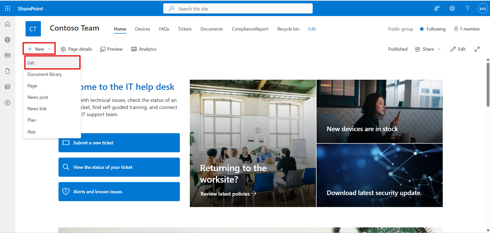

# Project 2: Lab Guide: Healthcare Compliance Agent 

_Project Title: Healthcare Compliance Assistant Agent_

_Estimated Time: 2 to 2.5 hours_  

_version: 25 June, 2025_

_Platform: Microsoft Copilot Studio + Power Automate +
SharePoint/OneDrive_ 
_

# Introduction

The Healthcare Compliance Agent is a virtual assistant built using
Microsoft Copilot Studio to streamline HIPAA compliance reporting. It
allows healthcare professionals to easily submit compliance reports,
access HIPAA guidelines, and automate report storage through SharePoint
and Power Automate. This solution improves efficiency, reduces manual
workload, and ensures timely documentation and regulatory adherence
across the organization.

# Prerequisites 

1.  Access to Microsoft Copilot Studio 
2.  Microsoft Teams 
3.  Power Automate and SharePoint/OneDrive permissions 
4.  HIPAA policy document (can be simulated) 

# Objectives 

In this solution, we automate the handling of user-submitted compliance
reports. The process includes the following key steps:

1.  **Store Compliance Report in SharePoint List**  
    When a user submits a compliance report through the agent, the
    metadata from the report is automatically captured and saved into a
    dedicated SharePoint list for secure record-keeping and future
    reference.

2.  **Trigger Email Acknowledgment  
    **Once the report is logged, an automated email is sent to the user
    to confirm successful submission, ensuring acknowledgment and
    improving communication transparency.

3.  **Optional Enhancement – Deploy App in Teams**  
    As an added enhancement, the solution can be deployed within
    Microsoft Teams to provide users with convenient access to the
    compliance reporting assistant directly within their Teams
    workspace.

# Core Tasks 

- Build a Healthcare Compliance Agent using Copilot Studio. 

- Provide knowledge-based HIPAA policy responses. 

- Allow users to submit compliance reports. 

- Save submissions securely in a SharePoint List  

- Send an auto-confirmation email using Power
  Automate. 

# Step-by-Step Execution

# Exercise 1: Access Microsoft Copilot Studio and Create an Autonomous Agent

Learn how to use Microsoft Copilot Studio to build a healthcare
compliance agent.  
This exercise covers knowledge source integration and conversation
design. You’ll configure a starting topic and set up a custom report
submission topic.

## Task 1: Create the Agent in Copilot Studio 

Set up a new agent using Microsoft Copilot Studio. Configure essential
details like name and purpose. This forms the base for your HIPAA
assistant.

1.  Go to [Copilot Studio](https://copilotstudio.microsoft.com/) and
    click **Create a new copilot**. 

2.  Click on Skip to configure and enter the following details, and
    click **Create**

**Name**: Contoso Healthcare Compliance Assistant. 

**Description**: "Create a compliance assistant for a hospital that
answers HIPAA-related queries and collects monthly compliance reports." 

**Instructions**:

You are a healthcare compliance assistant designed for Contoso Hospital.
Your responsibilities are:

1. Answer HIPAA-related queries using the uploaded knowledge source
(HIPAA Guidelines).

2. Guide users in uploading monthly compliance reports.

3. Collect the user's department name and uploaded file when they
submit a report.

4. Trigger a Power Automate flow to store the report in SharePoint and
send a confirmation email.

5. Be professional, helpful, and clear in your responses. Avoid legal
advice—stick to the policy information provided in your knowledge base.

3.  Let Copilot Studio generate the starter agent. 

## Task 2: Upload HIPAA Knowledge Source 

Upload relevant HIPAA documents to the agent’s knowledge base. Enables
the agent to answer compliance-related queries. Use PDFs or text files
for accurate knowledge referencing.

1.  Navigate to the **Knowledge** tab 🡪 click **+ Add a file**

2.  Click **+ Add a file** and upload a simulated HIPAA Guidelines PDF
    or DOC. 

3.  Enable the file for Q&A. 

4.  Test the agent using phrases like: 

> "What is PHI under HIPAA?" or
>
> "Can we store reports on external drives?" 

## Task 3: Customize Conversation Start Topic

Modify the agent’s welcome message and initial response flow. Tailor
greetings and guide users to report compliance issues. Enhance the
user’s first interaction with the assistant.

1.  Navigate to **Topics** 🡪 click **+Add a topic**

2.  Select **Conversation start topic** listed under **System** tab

3.  Customise the following Message, and click **Save**

## Task 4: Create Submit Compliance Report Topic

Build a topic to collect compliance report details from users. Include
inputs like summary, date, and file upload prompts. This allows users to
initiate a report submission via chat.

1.  Navigate to **Topics** 🡪click **+Add a topic** 🡪 **From blank**

2.  Click on Describe what the topic does and customise the phrases

**Name the topic:** Submit Compliance Report

**Update the phrase as follows:**

Create a topic that helps a hospital employee submit a monthly
compliance report

I want to submit a compliance report"

"Create a new compliance entry"

"Log a monthly report"

What is HIPAA?"

"Explain HIPAA rules"

"What are HIPAA compliance guidelines?"

"How do I stay HIPAA compliant?"

"Tell me about HIPAA regulations"

"HIPAA privacy rules"

3.  Add a question node to add agent query:

> **What is the report title?**

4.  **Identify** as: **User’s entire response**

> **Note**: repeat the same process to add the following questions:

- “Which month does the report cover?”

- “Please enter a summary of the report”

6.  Test the Agent for the phrases added

# Exercise 2: Healthcare Report Automation with SharePoint

This step sets up backend components to store compliance reports. You’ll
build a SharePoint site and create a structured list. It enables report
tracking and integration with automation flows.

## Task 1: Creating SharePoint site

Create a SharePoint team site for storing compliance artifacts. Choose a
meaningful name and configure site permissions. It will host your
compliance list and related files.

1.  Navigate to **SharePoint** from Copilot Studio **App launcher**

2.  Click on **+ Create site** 🡪select the site type (Team site)

3.  Click **Customize template** 🡪 select the desired template (IT Help
    Desk)

4.  Enter the site details: name, description and more 🡪 click **Next**

5.  Perform the **Privacy** settings (public) 🡪 click **Create**
    **site** and click **Finish**

**Note**: Creating site may take some time

## Task 2: Creating ComplianceReport SharePoint List

Build a custom list to store metadata about compliance reports. Add
fields like title, date, and file link. This list will be updated
automatically via Power Automate.

1.  Click **+ New** and select **List** from the **SharePoint** site
    home page

2.  Enter the list name, and click **Create**

**List Name**: ComplianceReport

3.  Click on **Add column** to create columns in the list 🡪 select
    **Text** and click **Next**

4.  Enter the **Name** of the column and **Description** (optional) 🡪
    click **save**

5.  Similarly, create **Report Month** and **Summary** columns

**Note**: Ensure that the summary column is of type **Multiple lines of
text**

# Exercise 3: Automating Compliance Report Logging and Notification

Use Power Automate to connect your agent to SharePoint. Build a flow to
capture report details and store them in the list. You’ll then link this
automation to your custom topic in the agent.

- 

## Task 1: Create the Instant Cloud Flow  

Configure the flow trigger using a Power Automate plugin. Send user
inputs from the agent to the SharePoint list. Ensure the report metadata
and uploaded files are logged.

1.  Navigate to Flows in Copilot Studio, and click **+ New Agent Flow**

2.  Select **When an agent calls the flow trigger**

3.  Click on **+Add an input** and set the following parameters for the
    flow

Report Title 🡪 Text

Report Month 🡪 Text

Summary 🡪 Text

4.  Add Create item Action to **store the report details** submitted by
    the user, such as:

> Report Title
>
> Report Month
>
> Summary

5.  Select the following details:

Site Address: SharePoint Site created (Contoso Site)

List Name: ComplianceReport

Select Advance parameters and map the variables:

- Report Title

- Report Month

- Summary

6.  Add an Action to send an confirmation email, select **Send an email
    action (V2)**

7.  Configure the email as:

To:

Subject:

Body:

8.  Search **SharePoint** and select Create item trigger

1.  Select your SharePoint site list created in your Contoso Team site
    (ComplianceReport)

> 
>
> 

2.  Click on **Advanced** parameters and select the required parameters
    as:

Report title

Report month

Summary

> 

3.  Select the thunderbolt to insert dynamic content to map the
    parameters and

4.  Add action **Send an email** (V2) to send an acknowledge email

5.  Configure the Email Action (Send an email (V2))

**To**: MOD Administrator

**Subject**: Compliance Report Received

***Note**: You can insert the dynamic value Title to show which report
was submitted.*

**Body**:

Dear Compliance Team,

This is to acknowledge that a new compliance report has been received
with the following details:

Report Title: \[Title\]

Report Month: \[Month\]

Summary: \[Summary\]

The information has been successfully logged into the system.

Regards,

Healthcare Compliance Assistant

**Compliance Report – July 2025**

**Report Title**:  
*Monthly HIPAA Compliance Summary – July 2025*

**Report Month**:  
*July 2025*

**Summary**:

This report summarizes HIPAA compliance activities conducted during July
2025.

- All staff completed mandatory HIPAA privacy and security training by
  July 10, 2025.

- No breaches of Protected Health Information (PHI) were reported.

- A routine internal audit was conducted on July 15, 2025, covering 10
  departments. No violations were found.

- A minor security incident involving a locked workstation was recorded
  and resolved within 24 hours.

- Updated policies on mobile device usage and email encryption were
  rolled out.

Overall, the organization maintained 100% compliance with HIPAA
standards during this period.

9.  Click on top left corner of the flow window, rename the flow and
    click **Save**

10. Add an action **Respond to the agent** to confirm the agent response

**Parameter**: Email

**Name**: confirmation message

**Value**: Your compliance report titled @{triggerBody()?\['text'\]} for
the month of @{triggerBody()?\['text_1'\]} has been submitted
successfully and logged in our system. Thank you!

Description: confirmation

11. Click on **Save draft** and **Publish**

12. Once the flow is published, click on **Test** to test the flow

13. Perform **Manual** test, enter the **Report Title**, **Report
    Month**, **Summary** and **Run** the flow

**HIPAA**

**Note**: A green check mark (✔️) next to each action indicates that the
action was executed successfully within the flow.

14. Open the SharePoint list **ComplianceReport** to see the user
    response stored.

15. Also, open the MOD admin tenant Outlook and see the acknowledgement.

## Task 2: Add the Flow to the Agent

1.  Go to Agent **Overview** page, navigate to **Tools and,** select the
    **flow (HIPAA) created.**

2.  Add and configure the flow to the **Contoso Healthcare Compliance
    Assistant**

3.  You can see the flow **HIPAA** in the Tools section of the agent

4.  Test the Agent for given phrase

5.  After the summary node, add the HIPAA flow to the agent and click
    **Connect**

6.  Once the connect is successful, test the agent for report submission

6.  Ensure the report is listed under the **CoplianceRepor**t list of
    SharePoint

7.  Check your MOD outlook for confirmation email

7.  After completing the successful test **Save** and **publish** the
    agent.

 

# Exercise 4: Deploy Agent to Teams

Validate your agent’s functionality in a chat interface. Deploy the
solution to Microsoft Teams for organization-wide access. This final
step ensures real-time user interaction is enabled.

## Task 1: Deploy HIPAA Healthcare Compliance Assistant to Teams App

Publish the agent to a Teams channel or chat group. Make the assistant
accessible to employees for reporting. Confirm the deployed bot
functions as expected.

1.  Go to the **Overview** page of the agent 🡪 navigate to **Channels**
    tab 🡪 select **Teams**

2.  Click **Add**

3.  Test the agent for the user query.

4.  Establish the flow connections with team’s app 🡪 click **Connect**

5.  Click **Submit**

6.  Successful connection will trigger the email acknowledgement and
    **SharePoint** site list creation

# Submission Checklist 

1.  Agent deployed to Teams 

2.  Knowledge source (HIPAA) added and tested 

3.  SharePoint List updated

4.  Auto-confirmation email working 

 
