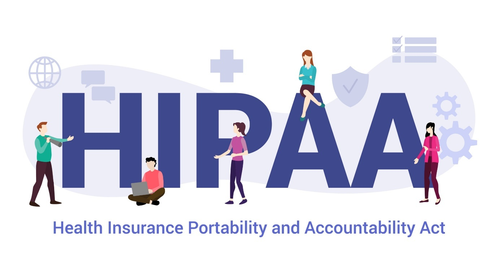
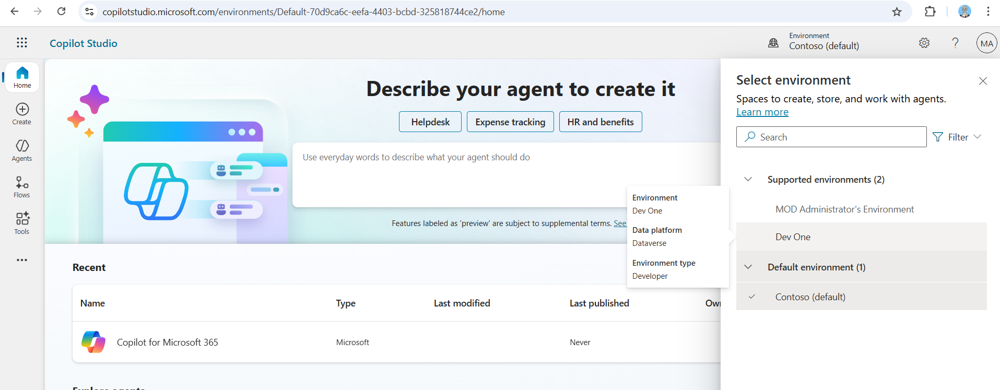
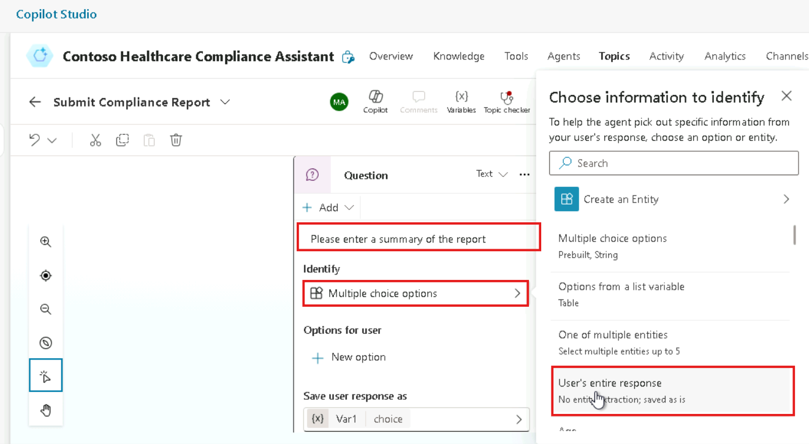
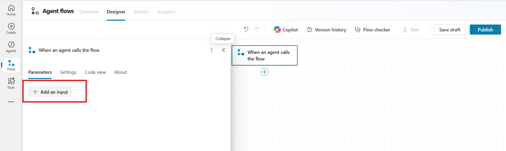

# 

# Project 2 Lab Guide: Healthcare Compliance Agent 

*Project Title: Healthcare Compliance Assistant Agent   
Estimated Time: 2 to 2.5 hours   
Platform: Microsoft Copilot Studio + Power Automate +
SharePoint/OneDrive *

# Introduction

The Healthcare Compliance Agent is a virtual assistant built using
Microsoft Copilot Studio to streamline HIPAA compliance reporting. It
allows healthcare professionals to easily submit compliance reports,
access HIPAA guidelines, and automate report storage through SharePoint
and Power Automate. This solution improves efficiency, reduces manual
workload, and ensures timely documentation and regulatory adherence
across the organization.



# Objectives

- Build a Healthcare Compliance Agent using Copilot Studio. 

- Provide knowledge-based HIPAA policy responses. 

- Allow users to submit compliance reports. 

- Save submissions securely in a SharePoint List  

- Send an auto-confirmation email using Power
  Automate. 

# Prerequisites 

1.  Access to Microsoft Copilot Studio 

2.  Microsoft Teams 

3.  Power Automate and SharePoint/OneDrive permissions 

4.  HIPAA policy document (can be simulated) 

# Architecture Diagram


# Key Personas 

1\. **Dr. Ayesha Bhatia**

> \- **Role**: Medical Administrator
>
> \- **Goals**: Submit monthly compliance summaries easily
>
> \- **Challenges**:
>
> \- Manual email process
>
> \- Inconsistent file naming

2\. **Marcus Wells**

\- **Role**: Compliance Officer

> \- **Goals**: Ensure timely and valid submissions from all departments
>
> \- **Challenges**:
>
> \- Missed reports
>
> \- Poor visibility
>
> \- No audit trail

3\. **Developer (Copilot Agent Builder - IT)**

> \- **Role**: Copilot Agent Builder (IT)
>
> \- **Goals**: Automate the intake and routing of compliance documents
>
> \- **Challenges**:
>
> \- Need to ensure security
>
> \- Ensure ease of use

# Step-by-Step Execution

# Exercise 1: Access Microsoft Copilot Studio and Create an Autonomous Agent

Learn how to use Microsoft Copilot Studio to build a healthcare
compliance agent.  
This exercise covers knowledge source integration and conversation
design. You’ll configure a starting topic and set up a custom report
submission topic.

## Task 1: Create the Agent in Copilot Studio 

Set up a new agent using Microsoft Copilot Studio. Configure essential
details like name and purpose. This forms the base for your HIPAA
assistant.

1.  Go to Copilot Studio and
    click **Create a new copilot**. 
```
https://copilotstudio.microsoft.com/environments/0fe56244-d1d7-efdc-9313-34edaf96940d/home
```


2.  Click on Skip to configure and enter the following details, and
    click **Create**


**Name**: Contoso Healthcare Compliance Assistant. 

**Description**: "Create a compliance assistant for a hospital that
answers HIPAA-related queries and collects monthly compliance reports." 

**Instructions**:

> You are a healthcare compliance assistant designed for Contoso
> Hospital. Your responsibilities are:
>
> 1\. Answer HIPAA-related queries using the uploaded knowledge source
> (HIPAA Guidelines).
>
> 2\. Guide users in uploading monthly compliance reports.
>
> 3\. Collect the user's department name and uploaded file when they
> submit a report.
>
> 4\. Trigger a Power Automate flow to store the report in SharePoint
> and send a confirmation email.
>
> 5\. Be professional, helpful, and clear in your responses. Avoid legal
> advice—stick to the policy information provided in your knowledge
> base.

3.  Let Copilot Studio generate the starter agent. 


## Task 2: Upload HIPAA Knowledge Source 

Upload relevant HIPAA documents to the agent’s knowledge base. Enables
the agent to answer compliance-related queries. Use PDFs or text files
for accurate knowledge referencing.

1.  Navigate to the **Knowledge** tab 🡪 click **+ Add a file**


2.  Click **+ Add a file** and upload a simulated HIPAA Guidelines PDF
    or DOC. 


3.  Enable the file for Q&A. 


4.  Test the agent using phrases like: 

> "What is PHI under HIPAA?" or
>
> "Can we store reports on external drives?" 


## Task 3: Customize Conversation Start Topic

Modify the agent’s welcome message and initial response flow. Tailor
greetings and guide users to report compliance issues. Enhance the
user’s first interaction with the assistant.

1.  Navigate to **Topics \>** click **+ Add a topic**

2.  Select **Conversation start topic** listed under **System** tab


3.  Customise the following message in a Message node , and click
    **Save**

> **Message: Hello I am the Contoso Healthcrae Compliance Assistant**
>
> **I can help you with**

- **Submit compliance report**

- **Understand HIPAA**

> **How can I help you today?**


## Task 4: Create Submit Compliance Report Topic

Build a topic to collect compliance report details from users. Include
inputs like summary, date, and file upload prompts. This allows users to
initiate a report submission via chat.

1.  Navigate to **Topics** 🡪click **+Add a topic** 🡪 **From blank**


2.  Click on **Describe what the topic does** and add the following
    phrases:

**Name the topic:** Submit Compliance Report

**Update the phrase as follows:**

Create a topic that helps a hospital employee submit a monthly
compliance report

I want to submit a compliance report"

"Create a new compliance entry"

"Log a monthly report"

“What is HIPAA?"

"Explain HIPAA rules"

"What are HIPAA compliance guidelines?"

"How do I stay HIPAA compliant?"

"Tell me about HIPAA regulations"

"HIPAA privacy rules"


3.  Add a question node to collect the user input:
   
4.  Question node 1:

  **Question: What is the report title?**

  **Identify**: **User’s entire response**

  **Variable: repTitle**


5.  Question node 2:
   
  **Question: “Which month does the report cover?”**
  
  **Identify: User’s entire response**
  
  **Variable: month**
  
> 
>
> 
> 
6.  Question node 3:
  **Question: “Please enter a summary of the report”**
  
  **Identify: User’s entire response**
  
  **Variable:**

> 
>
> 
>
> 

7.  Add a message node for agent response on all collected user input;

8.  Click on + sign, select **Send a message** to add a message node and
    update the message

> 
>
> **Message**: Your compliance report for the month of {x} month is
> submitted successfully.

9.  Test the Healthcare Compliance Agent for all above agent
    configurations


# Exercise 2: Healthcare Report Automation with SharePoint

This step sets up backend components to store compliance reports. You’ll
build a SharePoint site and create a structured list. It enables report
tracking and integration with automation flows.

## Task 1: Create SharePOint site 

Create a SharePoint team site for storing compliance artifacts. Choose a
meaningful name and configure site permissions. It will host your
compliance list and related files.

1.  Navigate to the **SharePoint** app from Copilot Studio **App
    launcher**


2.  Click on **+ Create site, and** select the site type (Team site)


3.  Click **Customize template** 🡪 select the desired template (IT Help
    Desk)


4.  Enter the site details: name, description and more 🡪 click **Next**


5.  Perform the **Privacy** settings \> click **Create** **site** and
    **Finish**

> **Privacy settings: Public**
>
> **Language: English**


**Note**: Creating site may take some time


## Task 2: Creating a SharePoint List: ComplianceReport

Build a custom list to store metadata about compliance reports. Add
fields like title, date, and file link. This list will be updated
automatically via Power Automate.

1.  Click **+ New** and select **List** from the **SharePoint** site
    home page



2.  Enter the list name, and click **Create**

**List Name**: ComplianceReport


3.  Rename the first column **'Title'** to **'Report** **title'**:  
    Click on **Title**, select **Column** **settings** \> **Rename**,
    enter **Report** **title**, and click **Save**.

**Name: Report title**


4.  Click on **Add column** to create columns in the list 🡪 select
    **Text** and click **Next**


5.  Enter the **Name** of the column and **Description** (optional) 🡪
    click **save**

**Name: Report title**


6.  Again, click on **Add columns**, select **Text** type \> click
    **Next**

7.  Enter the following details and **Save**

> **Enter the name: Report month**
>
> **Type: Text**


8.  Similarly, create **Summary** column of **Multiple lines of text**
    type and click **Next**


9.  Enter the details of the column and click **Save**

**Name: Summary**

**Type: Multiple lines of text**


# Exercise 3: Automating Compliance Report Logging and Notification

Use Power Automate to connect your agent to SharePoint. Build a flow to
capture report details and store them in the list. You’ll then link this
automation to your custom topic in the agent.

## Task 1: Create the Instant Cloud Flow  

Configure the flow trigger using a Power Automate plugin. Send user
inputs from the agent to the SharePoint list. Ensure the report metadata
and uploaded files are logged.

1.  Navigate back Contoso Healthcare Compliance Assistant overview page,
    select Flows in Copilot Studio, and click **+ New Agent Flow**


2.  Create and configure **When an agent calls the flow trigger** to
    **initiate the flow from a Copilot agent**.


3.  Click on **+Add an input** and configure the following input
    parameters for the flow

Report Title 🡪 Text

Report Month 🡪 Text

Summary 🡪 Text


4.  Add **Create item** trigger from **SharePoint** section to **store
    the report details** submitted by the user, such as:

> Report Title
>
> Report Month
>
> Summary

5.  Click on + sign Add an action node, search and select Create item
    trigger from SharePoint section


6.  Select the following details:

> **Site Address: Contoso Team site (Contoso Team Site)**
>
> **List name: ComplianceReport**

7.  Configure the **Advance parameters** and map the dynamic variables:

- Report Title

- Report Month

- Summary


**Note**: click on the thunderbolt icon to insert dynamic content to map
with the input parameters

8.  Create and configure **Send an email (V2)** trigger from **Outlook**
    section

- **Send an email (V2)** is a Power Automate action used to send emails
  via **Outlook (Office 365)** to notify someone automatically **— for
  example,** sending a confirmation or alert when an agent collects user
  input.


9.  Configure the email as:

> **To**: Enter the compliance officer’s or admin email (MOD Admin)
>
> **Subject**: New Healthcare Compliance Submission Received
>
> **Body**:
>
> Dear Compliance Team,
>
> A new healthcare compliance report has been submitted with the
> following details:
>
> Report title: /Report title
>
> Report month: /Report month
>
> Please review the attached document in the SharePoint folder.
>
> Regards,
>
> Healthcare Compliance Agent


**Note**: click on the thunderbolt icon to insert dynamic content to map
with the input parameters

- Example of compliance report:

> **Compliance Report – July 2025**
>
> **Report Title**:  
> *Monthly HIPAA Compliance Summary – July 2025*
>
> **Report Month**:  
> *July 2025*
>
> **Summary**:
>
> This report summarizes HIPAA compliance activities conducted during
> July 2025.

- All staff completed mandatory HIPAA privacy and security training by
  July 10, 2025.

- No breaches of Protected Health Information (PHI) were reported.

- A routine internal audit was conducted on July 15, 2025, covering 10
  departments. No violations were found.

- A minor security incident involving a locked workstation was recorded
  and resolved within 24 hours.

- Updated policies on mobile device usage and email encryption were
  rolled out.

> Overall, the organization maintained 100% compliance with HIPAA
> standards during this period.

10. Add **Respond to the agent** trigger to in Power Automate is used to
    **send a message back to the Copilot agent** after the flow finishes
    running.


11. Configure **Respond to the agent** trigger to send an email
    confirmation back to the agent

**Parameter**: Email

**Name**: confirmation message

**Value**: Your compliance report titled @{triggerBody()?\['text'\]} for
the month of @{triggerBody()?\['text_1'\]} has been submitted
successfully and logged in our system. Thank you!

Description: confirmation


12. Click on **Save draft** and **Publish** the flow to save all the
    configurations


13. Once the flow is published, **Rename** and **Test** to test the
    agent flow

14. To **Rename** the untitled flow navigate to the agent flow overview
    page, click on **Edit** button in the centre pane of the overview
    page and **Save** after providing the new name

**Flow name: HIPAA**


15. To test the **HIPAA** agent flow: navigate to the **Test** button on
    top right corner of the agent flow designer page , select manual
    test flow and click on **Test**


16. Perform **Manual** test, enter the **Report Title**, **Report
    Month**, **Summary** and **Run** **the** **flow**


**HIPAA**


**Note**: A green check mark (✔️) next to each action indicates that the
action was executed successfully within the flow.


17. A successful run will trigger an **email** to the healthcare team
    upon receiving a new compliance report and log the submitted details
    in the **ComplianceReport** SharePoint list.

18. Open the **ComplianceReport** SharePoint list view and verify the
    user input on compliance report stored.


19. Also, open the **MOD** **Admin** **Outlook** and verify the email
    triggered to healthcare compliance team upon new report received.


## Task 2: Add the Flow to the Agent

1.  Go to Agent **Overview** page, navigate to **Tools,** click on **+
    Add a tool** and select the agent flow **HIPAA**


2.  Add and configure the flow to the **Contoso Healthcare Compliance
    Assistant**


3.  You can see the flow **HIPAA** added in the **Tools** section of the
    agent


4.  Test the **Contoso Healthcare Compliance Assistant** for an added
    phrase


5.  After the summary node, add the agent flow HIPAA to the agent


6.  When prompted, click **Connect** to establish the connection between
    the Copilot agent and the agent flow.

7.  Click on **Submit** button to **Create or pick connections** window

**Or**

> **Tip**: Navigate to **Manage** **connections** option in Test your
> agent pane and click Connect if not connected.


8.  Once the connect is successful, test the agent for report submission
    and verify the email triggered upon new compliance report recived,
    and input logged into the SharePoint ComplianceReport list


- **Report listed under ComplianceRepor**t list of SharePoint


- **Check your MOD Admin Outlook for email triggered**


9.  After completing successful test, **Save** and **publish** the
    agent.

 

# Exercise 4: Deploy Agent to Teams

Validate your agent’s functionality in a chat interface. Deploy the
solution to Microsoft Teams for organization-wide access. This final
step ensures real-time user interaction is enabled.

## Task 1: Deploy HIPAA Healthcare Compliance Assistant to Teams App

Publish the agent to a Teams channel or chat group. Make the assistant
accessible to employees for reporting. Confirm the deployed bot
functions as expected.

1.  Go to the **Overview** page of the Healthcare Compliance Assistant
    agent \> navigate to **Channels** tab \> select **Microsoft**
    **Teams channel**


2.  Click on **Add** button to add the agent to the Teams channel


3.  Once the Healthcare Compliance Assistant agent is successfully
    added, interact with the agent in the Microsoft Teams channel and
    verify that the flow is triggered — sending an Outlook email and
    logging the data into the SharePoint list.


4.  Establish the agent connections with team’s app \> click **Connect
    or Allow** when prompted


5.  Connect the agent flow **HIPAA** to the **Teams** app, and click
    **Submit**


6.  Successful connection will trigger the **email** **acknowledgement**
    and **SharePoint** site list creation


# Key Learnings and Summary

This lab guide provided participants with a hands-on experience in
deploying an Autonomous Copilot Agent for Contoso Solutions' IT support
service desk. By following the step-by-step exercises, participants were
able to:

1.  **Set Up Copilot Studio**: Participants learned how to log into
    Copilot Studio, create and configure the IT support agent, and
    enable essential settings like generative AI and orchestrator for
    effective troubleshooting and ticket automation.

2.  **Navigate Power Apps**: Participants gained practical knowledge in
    logging into Power Apps, setting up a Dataverse table, and importing
    data from Excel to track and manage support tickets efficiently.

3.  **Enhance Bot Capabilities**: The exercises focused on adding a
    knowledge base to the bot, customizing the conversation start, End
    of conversation, Fallback, and Escalate topics to improve user
    interaction, and ensuring the bot could handle a wide range of IT
    support scenarios.

4.  **Agent created and deployed to Teams:** participants learned to
    Publish the Agent and share the Agent Contoso IT Assistant for team
    on Teams app for continuous automated IT support.

5.  **Automate IT Support Tasks**: Participants also learned how to
    automate the creation of support tickets using Power Automate,
    enhancing the bot's capability to manage unresolved issues and
    improve IT team workflows.

# Key Definitions

1.  **Trigger** : A trigger is an event that starts a workflow or
    process. In this project, the trigger is initiated when a user
    submits a travel request form through the Copilot Studio agent. This
    sends the request data to Power Automate, where the flow begins
    execution.

Example:

- “When a Power Virtual Agents (Copilot Studio) topic sends a request to
  Power Automate.”

2.**Tool** : A tool in Microsoft Copilot Studio refers to external
integrations or flows added to an agent topic. These are typically Power
Automate flows that the agent can invoke to perform backend operations
like sending an approval email or logging data to SharePoint.

Example:

- “Call a tool” → Select the Power Automate flow named
  TravelRequestsApprovalFlow to process and log the request.

3.  **Action** : An action is an individual step within a Power Automate
    flow that performs a specific function. Actions execute tasks such
    as sending an email, creating a SharePoint list item, or posting a
    Teams message based on data passed from the agent.

Examples of actions in this project:

- “Send an email (V2)” – Notifies the travel approver.

- “Create item” – Stores travel request data in a SharePoint list.

- “Get response details” – Extracts information from the Copilot Studio
  form submission

# Conclusion

By completing these exercises, participants were able to implement a
robust autonomous support system that improves response times, reduces
manual workload, and enhances overall productivity for IT support
operations. The integration of Copilot Studio, Power Apps, and Dataverse
ensures a seamless flow of information, automates routine tasks, and
optimizes support workflows, providing immediate troubleshooting
solutions to employees and automated ticket management for unresolved
issues.

 
