# Project 3: Lab Guide: Retail Inventory Assistant Agent 

## Scenario: Build a copilot for your retail customer webpage

_Duration: 120 mins_

_Version: 25 June 2025_

# Overview 

Develop a Virtual Assistant copilot for Contoso Electronics' website to
enhance customer support by simplifying the laptop discovery process,
providing tailored recommendations, and offering side-by-side device
comparisons. The copilot will also inform customers about current deals,
accessories, and protection plans. Additionally, it will assist with
appointment scheduling for further consultation with sales associates.
To streamline the post-purchase process, the copilot will provide
information on Contoso’s return policies, check return eligibility, and
enable customers to submit refund requests directly within the chat
interface for a seamless user experience.

# Prerequisites

To get the most out of this lab guide we recommend you have Work-School,
Admin Tenant ID and Password. Trial access with Power Apps, Power
Automate Flow, Copilot Studio, Lab Files (Refund Policy, Protection
Plan, Sales and Promotions)

# Objective

Develop a standalone Virtual Assistant copilot for Contoso Electronics'
webpage to assist customers in discovering the best products based on
their specific needs and preferences, as well as handling post-purchase
activities like verifying return eligibility and submitting refund
requests seamlessly.

# Solution Focus Area

Contoso Electronics, a leader in consumer electronics, offers a wide
variety of devices and accessories, making it challenging for customers
to find the right product that meets their unique requirements and book
appointment for sales assistance. In addition, customers may need
assistance with returns and refunds for products that do not meet their
expectations.

Currently, customers face two main challenges:

1.  **Product Discovery:** Customers struggle with exploring the vast
    array of options, comparing specifications, protection plan and
    understanding promotions and deals, which delays purchasing
    decisions and book appointment for further sales assistance.

2.  **Return Process:** Customers experience difficulties in navigating
    Contoso’s return policies and efficiently submitting refund
    requests.

To enhance customer satisfaction and streamline both the discovery and
post-purchase processes, Contoso Electronics will deploy a Virtual
Assistant copilot on its website. This AI-powered assistant, enhanced
with knowledge sources, will assist customers from the initial product
discovery phase through to post-purchase services like returns and
refunds.

# Persona and Scenario

- **Remy Morris** - Digital Solutions Architect 

- **Mark Brown** – Project lead 

- **David Flores** – App developer 

- **Jane Miller** – App tester 

- **Grady Archie –** Customer (Product Discovery)

- **Miriam Graham –** Customer (Refund Request)

These personas will participate in the following sequential scenarios: 

- Remy Morris, Digital Solutions Architect at Contoso Electronics,
  creates and plans digital architecture that aligns with the business
  need and articulates this framework to Mark Brown, the Project Lead at
  Contoso Electronics, and assists him in selecting the most suitable
  Power Platform tools for the implementation of the digital solutions. 

- Mark Brown provides David Flores with an overview of the tools and
  processes involved in developing a virtual agent with copilot studio
  and power apps and creating a booking appointment and refund request
  flow using Power Automate. 

- David successfully creates a virtual assistant, fulfilling all the
  requirements of Contoso electronics to provide virtual assistance for
  product information, booking assistance appointment and submit refund
  requests, which he then submits to Jane Miller for testing. 

- After thorough testing and validation, Mark Brown officially deployed
  a virtual agent on Contoso electronics website for virtual assistance
  to the customer and streamline the refund or return process.

- Grady Archie, a returning student, visits the Contoso Electronics
  website to find a laptop for his studies, gaming, and video editing.
  He engages with the Virtual Assistant copilot and outlines his
  specific needs, including battery life, durability, and performance.
  The copilot provides him with recommendations, compares specs,
  highlights current deals on Microsoft Surface laptops, and suggests
  compatible accessories. Grady decides to purchase the Surface Laptop
  Studio 2 but opts to schedule an appointment with a sales associate
  through the copilot to finalize his decision.

- Miriam Graham, a frequent shopper, wants to return a laptop due to
  unsatisfactory battery life. She interacts with the Virtual Assistant
  copilot to check if she is eligible for a return. The copilot quickly
  accesses Contoso’s return policies and confirms her eligibility.
  Miriam then asks the copilot to assist with submitting a refund
  request. The copilot guides her through the form submission process,
  enabling her to complete the refund request within the chat window.

# Pre-requisites 

For this use case, all participants will need the following: 

- Work – School or Admin Tenant Email Id and Password.

- Microsoft Power Apps Free Trial License

- Microsoft Power Automate Free Trial License

- Microsoft Copilot Studio Free Trial License

- Refund Policy File

- Protection Plan File

- Sales and Promotion File

**Note:** Please be aware that the user interface (UI) of Power Apps,
Copilot, Power Automate, and other related tools may change over time as
Microsoft continues to update its products. However, the core concepts
and logic behind their functionality will remain consistent. The
principles you learn in this lab can still be applied, even if the UI
looks different in the future.

# Exercise 1: Signup and Build a Copilot in Microsoft Copilot Studio with New AI Capabilities

In this exercise, you will learn how to build and configure a copilot in
Microsoft Copilot Studio using its AI capabilities. You will begin by
signing into the platform, followed by creating and setting up a custom
copilot for Contoso Electronics Services. The tasks will cover
configuring security settings, enabling generative AI, and building a
knowledge base to empower the copilot to handle tasks like providing
information and booking appointments.

## Task 1: Sign In Copilot Studio

1.  Navigate
    to [https://copilotstudio.microsoft.com](https://copilotstudio.microsoft.com/) and
    click on **sign in.**

2.  Enter **Email ID** (School, Work or Admin Tenant) which have access
    of Copilot Studio trial license and Power Apps trial license. For
    this lab we use Admin Tenant ID. Then click on **Next** button to
    proceed.

**Note:** To create Admin Tenant ID use the following link to set up a
new ID: [Create New
ID](https://go.microsoft.com/fwlink/?LinkId=2139833&ru=https%3A%2F%2Fwww.microsoft.com%2Fen-us%2Fdynamics-365%2Fproducts%2Fcustomer-service%3Ftsapp%3Dcustomerservice%26trialflow%3Dadmin&email=bumblebee.code%40outlook.com).
This will allow you to complete the registration and resolve any sign-in
issues.

3.  Enter the **Password** in the field and click on the **Sign in.**

4.  In the **Welcome to Copilot Studio** popup, leave the country/region
    as the default value and select get started.

5.  At the Welcome to Copilot Studio! popup, select **Skip**.

## Task 3: Create Contoso Electronics Services Copilot

1.  Once logged in, make sure you are in the right environment. if not,
    please select the right environment **(Dev One).**

2.  On the left navigation pane, find and click on **Create**. Then,
    select the  + **New Agent** tile to begin the setup process.

3.  When prompted, select **Skip to configure** to proceed without
    additional configuration options at this stage.

4.  In the **Name** text box, type **Contoso Electronics Services**.
    This will be the name of your new copilot.

5.  In the **Description** text box, enter **“Provide information about
    laptops, refund or return policy, and facilitate booking or
    appointment.”** This description helps define the copilot’s role and
    functionality.

6.  In the **Instructions** text box, type “**Create a copilot for
    topics related to providing laptop information, processing refund
    request, and booking appointment with sales executives or for
    product returns.”** This guides the copilot in handling specific
    tasks and user interactions.

7.  Choose **English** from the language options. This will set the
    primary language for interactions with the copilot.

8.  Finally, in the top-right corner of the screen, click
    on **Create** to finalize and deploy your new copilot.

## Task 4: Configure Security and Generative AI

1.  In Microsoft Copilot Studio, locate and click on
    the **Settings** option in the top-right corner of the screen. This
    action will open the settings menu.

2.  Choose **No authentication** from the available options. This
    setting will allow unrestricted access to your copilot without
    requiring users to log in.

3.  Click **Save** to apply the authentication settings.

4.  On the left-hand side, above the Security tab, select **Generative
    AI**.

5.  For **“How strict should the content moderation be?”**,
    choose **Medium**. This setting balances content moderation with
    flexibility.

6.  Click **Save** to apply these settings.

7.  After saving your settings, click **Close** to exit the settings
    window.

8.  In the Copilot pane on the left-hand side of the screen, select your
    copilot to return to the **Overview** tab. This will take you back
    to the main dashboard where you can manage your copilot.

9.  Scroll down and **Disable** Allow the AI to use its own general
    knowledge (preview).

10. Navigate to the **Knowledge** section next to overview option and
    click on it.

11. Click on the **+ Add Knowledge** button to begin adding new
    knowledge sources.

12. Click on the **Browse** button to locate and select the **Refund
    Policy, Sales and Promotions and Protection Plan** lab file and
    click on **Open**.

13. Click **Add** to include this file as part of the copilot’s
    knowledge base.

## Task 6: Publish Your Copilot

1.  After File are **Ready**, Go to **Publish** button on the right side
    of the screen. Click on the **Publish** button to start the
    publishing process.

2.  A confirmation dialog may appear. Select **Publish** again to
    finalize and publish your copilot.

## Conclusion

After completing this exercise, you have gained the following knowledge:

1.  Successfully created and deployed a custom copilot in Microsoft
    Copilot Studio.

2.  Configured security settings and enabled generative AI for
    intelligent interactions.

3.  Built a knowledge base to enhance the copilot's response
    capabilities.

4.  Published the copilot for real-time use in customer service tasks
    like product information, refunds, and appointment bookings.

# Exercise 2: Create and Manage Topics

This lab exercise focuses on the creation and management of various
topics using Copilot Studio. Participants will explore how to configure
a virtual assistant that responds to customer inquiries regarding
product information, laptop deals, comparisons, appointments, and
protection plans. Through practical tasks, learners will create topics
from scratch, set up trigger phrases, and utilize advanced options like
generative answers. By the end of this exercise, participants will
understand how to enhance customer interactions using dynamic responses
and structured conversations powered by AI, driving improved customer
engagement and automation.

## Task 1: Create a Topic "Product Information"

1.  Open Copilot Studio and select the copilot you've created for this
    project.

2.  In the top bar, select **Topics** which is located next to
    **Agents**.

3.  Click on **+ Add a topic** to create a new topic. Choose **From
    blank** to start with a blank template.

4.  In the new topic canvas, at the top of the screen, enter the name of
    the topic **"Product Information"**.

5.  In the canvas, you'll see a **Trigger node**. In
    the **Describe** section, enter the following phrases to trigger
    this topic:

**Laptop Information, Information about laptop, Laptop Details, Laptop
Feature, Laptop Specification, Buy Laptop**

6.  Below the Trigger node, click on the **+** sign to create a new
    node. Select **Advanced options**, then choose **Generative
    Answer**. A Generative Answer node will be created.

7.  In the Generative Answer node, click on the **Input** option
    variable window will open.

8.  In the **Select a variable** window, select **System** and scroll
    down to choose **Activity.Text**.

9.  In the Generative Answer node, click on the **Edit** option in
    the **Data Source** section.

10. Enable the option **Search only selected sources**.

11. Scroll up and click on the **(X)** to close Create generative answer
    properties window.

14. Click on the **Save** button to save your configurations for
    the **"Product Information"** topic.

## Task 2: Create “Student laptop deals” topic

1.  Open Copilot Studio and select the copilot you've created for this
    project.

2.  In the top bar, select **Topics** which is located next
    to **Agent**.

3.  In the canvas, you'll see a **Trigger node**. In
    the **Describe** section, enter the following phrases to trigger
    this topic:

**Student laptop deals. Laptop deals, Deals, Deals about laptop, Product
deals, Latest deals, Current deals, Trending deals.**

4.  Below the Trigger node, click on the **+** sign to create a new
    node. Select **Advanced options**, then choose **Generative
    Answer**. A Generative Answer node will be created.

5.  In the Generative Answer node, click on the **Input** option
    variable window will open.

6.  In the **Select a variable** window, select **System** and scroll
    down to choose **Activity.Text**.

7.  In the Generative Answer node, click on the **Edit** option in
    the **Data Source** section.

8.  Enable the option **Search only selected sources**.

9.  Choose the **Sales and Productions** doc from the options displayed
    and scroll down.

10. Click on the **Save** button to save your configurations for
    the **"Laptop Deals"** topic.

## Task 3: Create a Topic “Compare laptop”

1.  Open Copilot Studio and select the copilot you've created for this
    project.

2.  In the top bar, select **Topics** which is located next
    to **Agents**.

3.  Click on **+ Add a topic** to create a new topic. Choose **From
    blank** to start with a blank template.

4.  In the new topic canvas, at the top of the screen, enter the name of
    the topic **"Compare laptop"**.

5.  In the canvas, you'll see a **Trigger node**. In
    the **Describe** section, enter the following phrases to trigger
    this topic:

**compare laptop, compare product, laptop comparison, compare between
laptops**

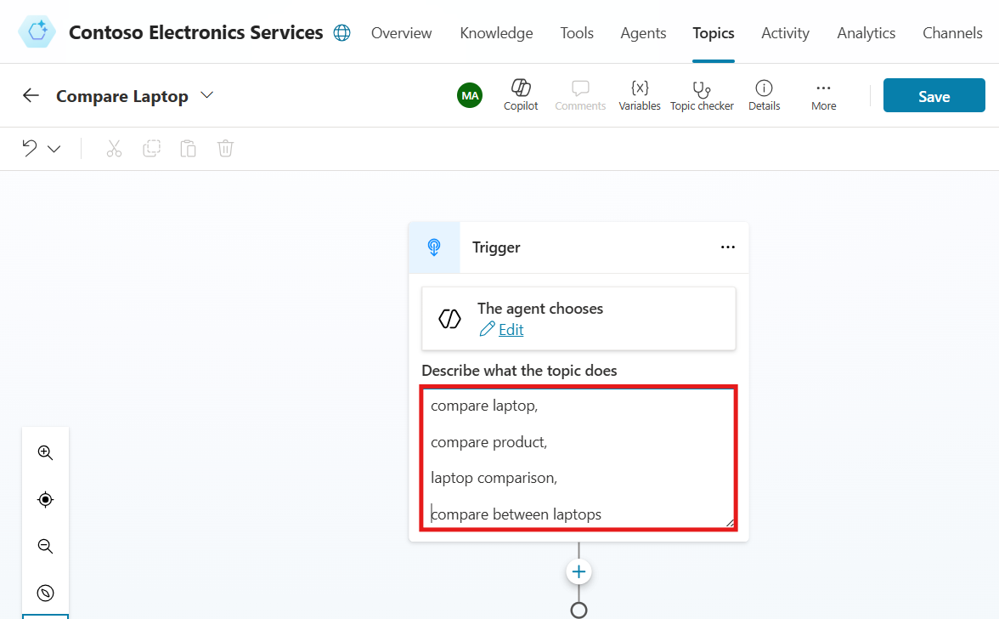

6.  Below the Trigger node, click on the **+** sign to create a new
    node. Select **Advanced options**, then choose **Generative
    Answer**. A Generative Answer node will be created.

7.  In the Generative Answer node, click on the **Input** option
    variable window will open.

8.  In the variable window, select **System** and scroll down to
    choose **Activity.Text**.

9.  In the Generative Answer node, click on the **Edit** option in
    the **Data Source** section.

10. Enable the option **Search only selected sources**.

11. Choose the **Sales and Promotions** doc from the options displayed
    and scroll down.

12. Scroll up and click on the **(X)** to close Create generative answer
    properties window.

> 

14. Click on the **Save** button to save your configurations for
    the **"Compare Laptop"** topic.

> 

## Task 4: Create a Topic "Book Appointments"

1.  Open **Copilot Studio** and select the copilot you've created for
    this project.

2.  In the top bar, select **Topics** which is located next
    to **Agents**.

3.  Click on **+ Add a topic** to create a new topic. Choose **From
    blank** to start with a blank template.

4.  In the new topic canvas, at the top of the screen, enter the
    name **"Book Appointments"**.

5.  In the canvas, you'll see a **Trigger node**. In
    the **Describe** section, enter the following phrases to trigger
    this topic:

**Book an appointment, Schedule a meeting, Make a reservation, Set up an
appointment, Arrange a consultation, Virtual appointment, Appointment,
Schedule booking.**

6.  Below the Trigger node, click on the **+** sign to create a new
    node. Select **Send a Message Node,** a **Message Node** will be
    created. In the Message node, enter the following text:

**Thank you for choosing our virtual assistant for your laptop
consultation. We are here to help you. To book a virtual appointment,
simply complete the form below.**

7.  Below the Message node, click on the **+** sign to create a new
    node. Select **Ask with Adaptive Card**. An Adaptive Card Node will
    be created.

8.  In the Adaptive Card node, select the **three dots** (More Options)
    and then select **Properties**.

9.  In the Adaptive Card properties, below the **Edit JSON**. Paste the
    provided **JSON** code to create the adaptive card.

10. Select **Variables** to open the Variables pane.

11. Select all the boxes on the right-hand side for the topic variables.

10. Click on **Save** to save your configuration.

13. Below the Adaptive card node, click on the + **sign** to create a
    new node. Select **Ask a Question**. A **Question Node** will be
    created.

> 

14. In question node select **Enter a Message** and enter the following
    text:

> **Thank you, Full Name! Your Appointment Type appointment has been
> booked for Appointment Date at Appointment Time. Thank you for using
> our service.**

15. Replace the placeholders Full Name, Appointment Type, Appointment
    Date, and Appointment Time with the appropriate variables by
    clicking on the **{X}** icon and selecting the corresponding custom
    variables.

16. In the Question node, select **Multiple Choice** as the identify.

17. In the **Options for user** section, enter the following choices:

    1.  **Yes**

    2.  **No**

18. Below **Save the user's response** a new variable creates, click on
    the variable name (Var1), variable properties window will open,
    where you can rename the variable name with **AfterAppointment**.
    Click the **(X)** to close the variable properties window.

19. Under the **Yes** condition, click on the **+** sign and
    select **Topic Management**, then choose **Go to Another Topic**. A
    topic selection window will open—search for **Conversation
    Start** and select the **Conversation Start** topic.

20. Under the **No** condition, click on the **+** sign and
    select **Send a Message**. A Message Node will be created. In the
    Message node, enter the following text:

**Thank you for using our service. Have a nice day.**

11. Once all nodes are configured, click on **Save** to finalize and
    save your "**Book Appointments**" topic.

## Task 5: Create Protection Plan Topic

1.  Open Copilot Studio and select the copilot you've created for this
    project.

2.  In the top bar, select **Topics** which is located next
    to **Agents** .

3.  Click on **+ Add a topic** to create a new topic. Choose **From
    blank** to start with a blank template.

4.  n the new topic canvas, at the top of the screen, enter the name of
    the topic **"Protection Plan"**.

5.  In the canvas, you'll see a **Trigger node**. In
    the **Describe** section, enter the following phrases to trigger
    this topic:

**Protection Plan, Laptop Protection Plan, Protection, Protect Plan**

6.  Below the Trigger node, click on the **+** sign to create a new
    node. Select **Advanced options**, then choose **Generative
    Answer**. A Generative Answer node will be created.

7.  In the Generative Answer node, click on the **Input** option
    variable window will open.

8.  In the variable window, select **System** and scroll down to
    choose **Activity.Text**.

9.  In the Generative Answer node, click on the **Edit** option in
    the **Data Source** section.

10. Enable the option **Search only selected sources**.

11. Choose the **Protection Plan** doc from the options displayed and
    scroll down.

14. Click on the **Save** button to save your configurations for
    the **"Protection Plan"** topic.

## Task 6: Configure the Conversation Start Topic

1.  Navigate to Copilot Studio and select the Copilot you've created for
    this project.

2.  In the top navigation bar, select **Topics**, which is located next
    to **Agents**.

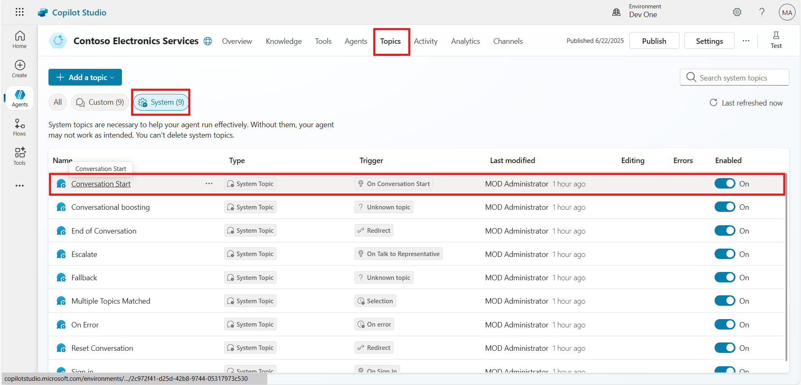

3.  In the Topics section and select the **System** option to view the
    available system topics.

4.  Find and select the **Conversation Start** topic to open it.

5.  Below the **Trigger** node, a message node is available. Replace the
    message with the given below content.

**Hello! I am Contoso Virtual Agent. How May I Help You?**

6.  Click the **Save** button to save your configuration.

## Task 7: Configure the Conversational Boosting Topic

1.  Navigate to Copilot Studio and select the Copilot you've created for
    this project.

2.  In the top navigation bar, click on **Topics**, which is located
    next to **Agents**.

3.  In the Topics section, select the **System** option to view the
    available system topics.

4.  Find and select the **Conversational Boosting** topic to open it.

5.  In the **Generative Answer** node, click on **Edit** below the data
    source section.

6.  Toggle on the Search Only Selected Sources option.

7.  Select the **Refund Policy, Protection Plan and Sales and
    Promotions** doc knowledge base as the sources for search from.

8.  Close the Generative Answer properties window once you're done.

9.  Click on the **Save** button to save the configuration.

## Task 8: Use Generative Answers in the System Fallback Topic

1.  In the Copilot pane on the left-hand side of the screen, select the
    copilot you've created to return to the **Knowledge** tab.

2.  Select the Topics tab located at the top of the screen.

3.  Within the Topics tab, select the **System** option to view the
    available system topics.

4.  Find and select the **Fallback** topic to open it.

5.  In the **Fallback** topic, locate the existing message node.

6.  Click on the three dots (•••) in the top-right corner of the message
    node and select **Delete** to remove it.

7.  Below the Condition node, click on the + icon to add a new node.
    Select Advanced and then choose Generative answers from the options.

8.  In the Generative answers node, for the Input field,
    select **Activity.Text** from the system variables.

9.  Under the **Data sources** section, click on **Edit**.

10. Toggle on **Search only selected sources** to ensure that the AI
    pulls information only from specific knowledge sources.

11. From the list of available sources, select the **Refund Policy,
    Sales and Promotions and Protection Plan Doc** as the knowledge
    source.

12. Deselect the option **Allow the AI to use its own general
    knowledge** to ensure the AI only uses the specified knowledge
    source.

13. After completing the above steps, click **Save** to save the
    generative answers configuration for the Fallback topic.

## Task 9: Publish the Copilot

1.  In the Copilot Studio, find the **Publish** button. This button is
    typically placed on the right side of the window.

2.  Click on the **Publish** button.

3.  A confirmation window may appear; click **Publish** again to
    confirm.

## Conclusion

After completing this exercise, you have gained the following knowledge:

1.  Successfully created and managed topics using Copilot Studio.

2.  Configured advanced nodes like generative answers and adaptive
    cards.

3.  Developed structured responses for topics like product information,
    deals, and appointments.

4.  Applied real-world use cases for enhanced customer engagement
    through Copilot.

5.  Gained a deeper understanding of how to automate and streamline
    customer service interactions using AI.

# Test the Copilot

To test the functionalities of your Copilot and Power Automate flows,
follow these steps:

1.  Click on the three-dot right side of the window and select **Go to
    demo website.** A demo website window will open start the
    conversation into the website chat window.

**Note:** Testing Copilot with the same prompt multiple times may yield
varying responses due to contextual learning, dynamic data access, and
inherent randomness in its output generation.

2.  Once the demo website launch and message appear in chat box enter
    the following trigger phrases to test the topics you created:

3.  **What are some deals on student laptops right now?**

4.  Tell me more about Surface Laptop Go

5.  Compare laptop surface laptop go 3 and surface laptop studio 2.

6.  I want to know about the protection plan?

# Exercise 3: Signup for Power App and Create Custom Table

In this exercise, you'll learn how to sign up for Microsoft Power Apps
and create a custom table by following a series of practical steps. The
exercise begins with signing into the Power Apps platform using the same
credentials as Copilot Studio and setting up the correct environment.
From there, you'll be guided through creating a new solution and
publisher within Power Apps. Once the solution is set, you will
configure it as your preferred choice. Finally, the exercise walks you
through the process of building a custom table, "Book Appointments,"
with specific columns to store appointment data. This hands-on exercise
provides essential experience with Power Apps, helping you understand
the core functionalities of creating and managing tables within a
solution.

## Task 1: Sign Up for Microsoft Power Apps

1.  In Copilot Studio Home page \> click on three dots on the left
    navigation pane \> select Power Apps

## Task 2: Create a Solution in Power Apps

1.  Once signed in Power Apps, In the left-hand navigation pane, find
    and select **Solutions**.

2.  In the **New solution** form, enter **Contoso Electronics** as the
    Display Name for your solution. This name identifies your solution
    within the environment.

3.  Next, you need to assign a publisher to your solution. Click on **+
    New publisher** to create a new one.

5.  Fill in the following details in the publisher form:

    1.  **Display name**: Contoso

    2.  **Name**: contoso

    3.  **Prefix**: contoso

6.  After entering these details, click **Save**.

7.  Once the publisher is created, select **Contoso (contoso)** from the
    Publisher dropdown.

8.  Click on **Create** to finalize your new solution.

9.  After creating your solution, click on **Back** in the left corner
    of the screen. This takes you back to the main Solutions page, where
    you can see your newly created solution listed.

## Task 3: Set the Preferred Solution

1.  In the Power Apps Maker portal, navigate to
    the **Solutions** section in the left-hand menu.

2.  Locate the option **Manage** under **Current preferred
    solution** and click on it.

3.  A list of available solutions will be displayed. Find and
    select **Contoso Electronic (contoso)** from the list.

4.  Once selected, click on **Apply** to set this solution as your
    preferred choice.

## Task 4: Create the "Book Appointments" Table

1.  In the Power Apps Maker portal, select **Tables** from the left-hand
    navigation pane.

2.  Click on **+ New table**, and then choose **Create new table** to
    start creating your new table.

3.  Then select **Start from blank** to create a table.

4.  By default, the new table will be named "**Table1**." Double click
    on table name and rename it to **Book Appointments**.

5.  **Appointment Type Column:**

6.  Click on the down arrow next to the first column, and then select
    the edit column button.

7.  Change the display name to **Appointment Type** and click
    on **Update**.

8.  **Full Name Column:**

Click on the **+ New column** button, change the display name to **Full
Name**, and save the column.

9.  Email Address Column:

Click on the **+ New column** button, change the display name to **Email
Address**, and save.

10. Phone Number Column:

Click on the **+ New column** button, change the display name to **Phone
Number**, and save.

11. Date Column:

Click on the **+ New** **column** button, change the display name
to **Date**, and save.

12. Time Column:

Click on the **+ (add column)** button, change the display name
to **Time**, and save.

13. After adding all the necessary columns, click on the **Save and
    exit** button to finalize and create the **"Book
    Appointments"** table.

## Conclusion

After completing this exercise, you have gained the following knowledge:

1.  Successfully signed up for Microsoft Power Apps using Copilot Studio
    credentials.

2.  Created a new solution named "Contoso Electronics" with a custom
    publisher.

3.  Set the "Contoso Electronics" solution as the preferred solution in
    Power Apps.

4.  Built a custom table called "Book Appointments" with the required
    columns for managing appointments.

5.  Acquired foundational knowledge of Power Apps' environment,
    solutions, and table creation process.

# Exercise 4: Create Power Automate Flow and Integrate Actions

In this exercise, you will learn how to create a Power Automate flow and
integrate it with a Copilot action to automate the process of booking
appointments. By following the steps provided, you will configure a
custom flow that captures appointment details like date, time, and
contact information, and maps them into a Dataverse table. Once the flow
is set up, you will integrate it within Copilot Studio, allowing Copilot
to trigger the flow, gather input data from users, and complete the
appointment booking process seamlessly.

## Task 1: Create Power Automate Flow to Book an Appointment

1.  Go Back to Copilot studio Contoso Electronics Copilot, Select
    the **Flows** tab to start configuring actions for your Copilot.

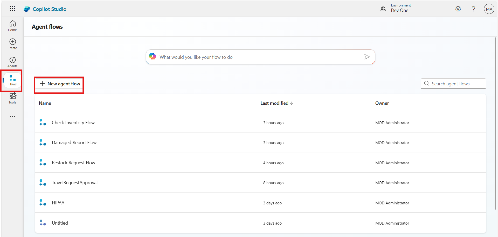

2.  Select **Text** for the input type and configure the following
    inputs by repeating the process:

    1.  Enter **Type** in input field for Appointment Type

    2.  Enter **Date** in input field for Appointment Date

    3.  Enter **Email** in input field for Email Address

    4.  Enter **Name** in input field for Full Name

    5.  Enter **Phone** in input field for Phone Number

    6.  Enter **Time** in input field for Appointment Time

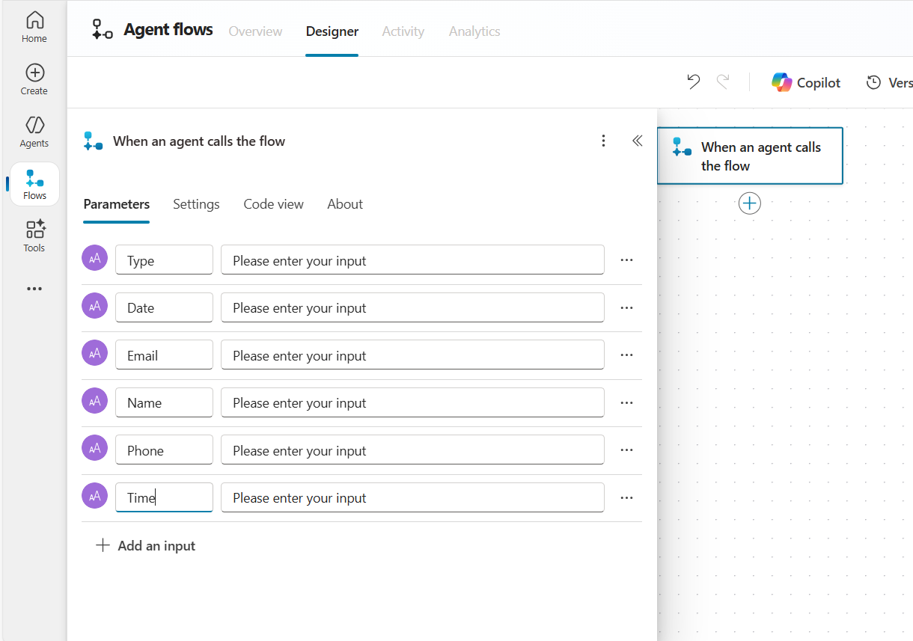

3.  Click on the + icon, In the Search field, type Dataverse and
    select See more for the Dataverse connector.

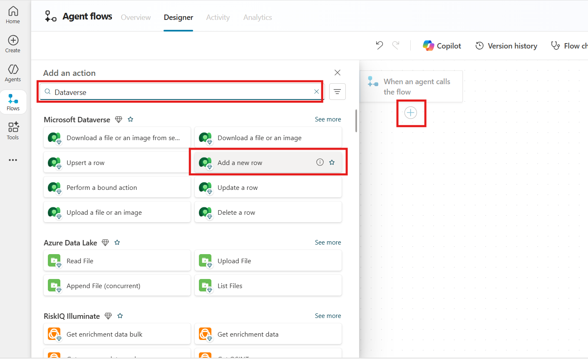

4.  Login with the same credential for the Oath Sign.

> 
>
> **Connection name**: MOD Admin
>
> **Authentication Type**: Oauth
>
> 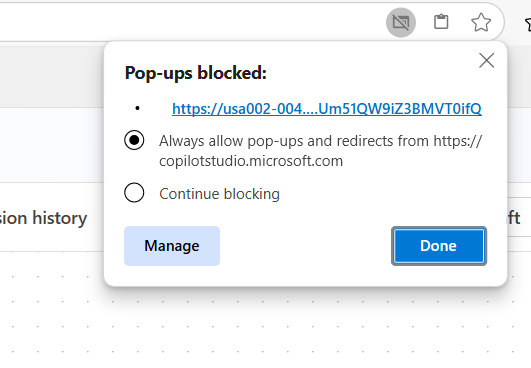
>
> 
>
> 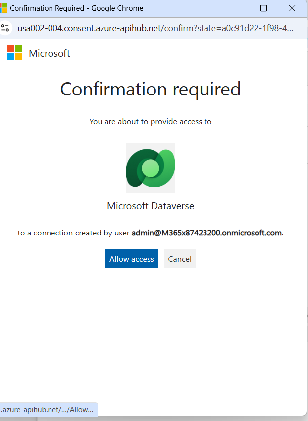

5.  Choose **Book Appointments** for the table name.

6.  Create Respond to agent action.

7.  Click on **Settings**.

8.  Ensure that **Asynchronous Response** is set to **Off**.

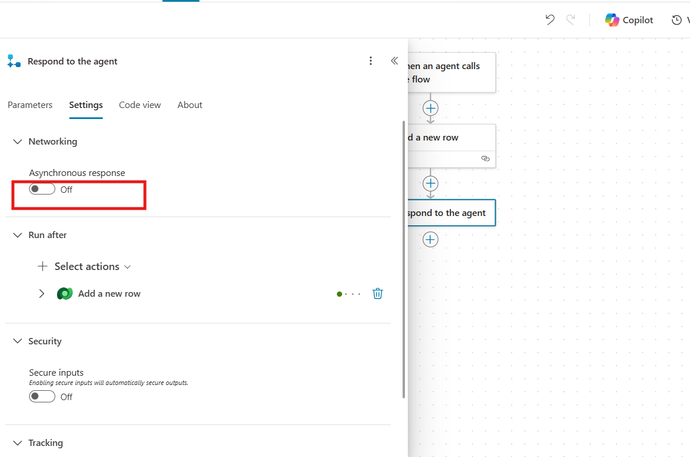

9.  Rename the flow: Book Appointments Flow

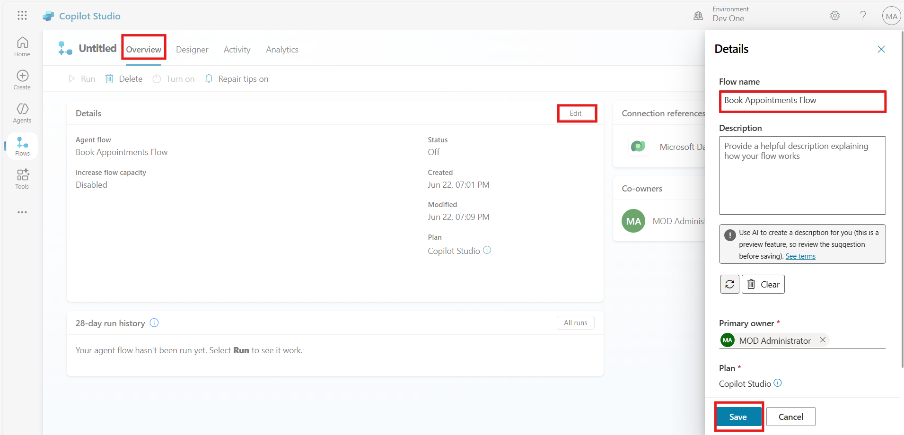

10. Run the flow \> provide the details required \> click Run flow

## Task 2: Create Action in Copilot for Book Appointments

1.  Go to copilot window and click on **Refresh**, (If the Copilot
    window was closed, reopen it and navigate back to the **Copilot
    Studio,** go to the **Tools**  tab and click on **+ Add a Tool**.)

2.  Select the Flow you have created: Book Appointments Flow

3.  Click on Add agent. The flow will now be added as an action.

4.  The Flow is now added to your Copilot agent as action \> Navigate to
    Tools tab to view the flow added.

4.  Navigate to the **Topics** section and select the **Book
    Appointments** topic.

5.  Below the Adaptive Card node, click on the **+** sign to create a
    new node.

6.  Select **Call an action**. Choose the **Book Appointments Flow**.
    This action will now be added below the Adaptive Card node.

7.  In the action node, you need to map each input field to the
    appropriate variable created by the Adaptive Card:

    1.  **Type** Input: Click on the input field, then
        select **Appointmenttype** from the custom variables.

    2.  **Date** Input: Click on the input field, then
        select **appointmentDate** from the custom variables.

    3.  **Email** Input: Click on the input field, then
        select **contactEmail** from the custom variables.

    4.  **Name** Input: Click on the input field, then
        select **fullName** from the custom variables.

    5.  **Phone** Input: Click on the input field, then
        select **contactPhone** from the custom variables.

    6.  **Time** Input: Click on the input field, then
        select **appointmenttime** from the custom variables.

8.  After mapping all the variables, click on the **Save** button to
    save the topic configuration.

## Task 5: Publish the copilot

1.  From top right corner, go to publish and click on it.

## Conclusion

After completing this exercise, you have gained the following knowledge:

1.  Successfully created a Power Automate flow named **Book Appointments
    Flow**.

2.  Configured multiple input fields such as appointment type, date, and
    contact details.

3.  Mapped the inputs to corresponding Dataverse fields for appointment
    booking.

4.  Integrated the flow with Copilot Studio by adding it as an action.

5.  Ensured correct mapping of input variables within the Copilot topic.

6.  Published the flow and tested it within the Copilot environment for
    seamless integration.

# Test Copilot

To test the functionalities of your Copilot and Power Automate flows,
follow these steps:

Click on the three-dot right side of the window and select **Go to demo
website.** A demo website window will open start the conversation into
the website chat window.

**Note:** Testing Copilot with the same prompt multiple times may yield
varying responses due to contextual learning, dynamic data access, and
inherent randomness in its output generation.

1.  Once the demo website launch and message appear in chat box enter
    the following trigger phrases to test the topics you created

2.  What are current student laptops deals?

3.  Book Appointment for further assistance

4.  Fill the complete form and click on the **Book Appointments**

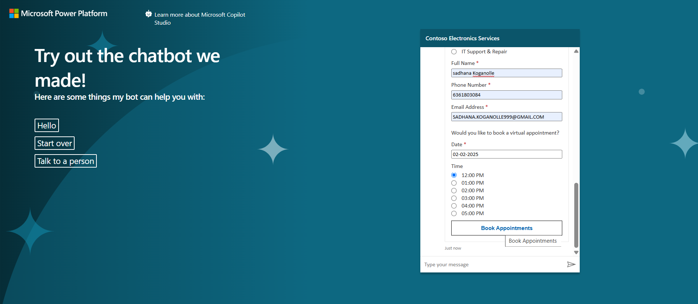

5.  Ensure that the details entered in the Appointment Booking are
    accurately reflected in the "Book Appointments" table in Power Apps.

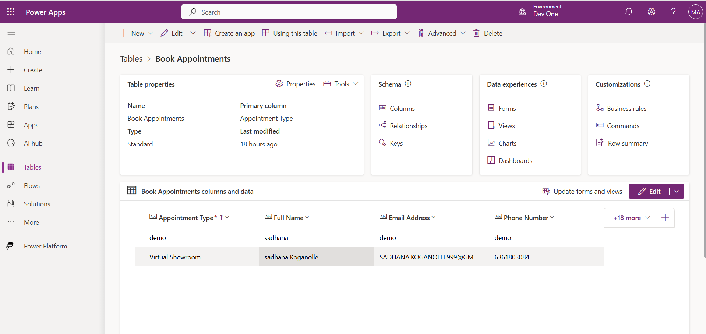

# Exercise 5: Create Power Apps Table for Refund Requests

In this exercise, you will learn how to create a custom table in Power
Apps for managing refund requests. The table will store key details such
as customer information, purchase data, and refund-related entries. By
following these steps, you'll understand how to add columns for specific
data fields like Full Name, Email, Order Number, and more. This hands-on
task will provide you with essential knowledge on table creation and
column management within Power Apps, preparing you to efficiently handle
refund processes in a structured format.

1.  Navigate to Power Apps, In the Power Apps Maker portal,
    select **Tables** from the left-hand navigation pane.

2.  Click on **+ New table**, and then choose **Create new table** to
    start creating your new table.

3.  Then select **Start from blank** to create a table.

4.  By default, the new table will be named **"Table1."** Double click
    on Table 1 name and rename it to **Refund Requests**,

5.  **Full Name Column:**

> Click on the down arrow next to the first column, and then select the
> edit column button.

6.  Change the display name to **Full Name** and click on **Update**.

7.  Date of Purchase Column:

> Click on the **+ New column** button, change the display name
> to **Date of Purchase**, and save.

8.  Description Column:

> Click on the **+ New column** button, change the display name
> to **Description**, and save.

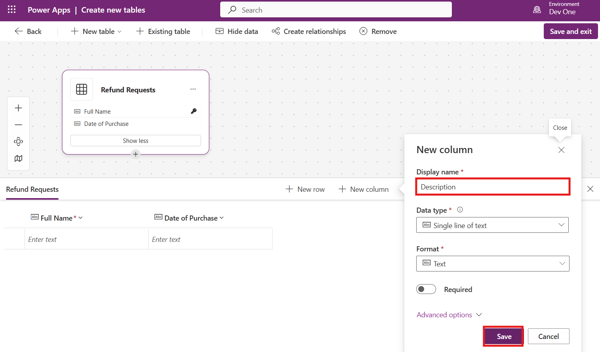

9.  Email Column:

> Click on the **+ New column** button, change the display name
> to **Email**, and save.

10. Order Number Column:

> Click on the **+ New column** button, change the display name
> to **Order Number**, and save.

11. Order Type Column:

> Click on the **+ New column** button, change the display name
> to **Order Type**, and save.

12. Phone Number Column:

> Click on the **+ New column** button, change the display name
> to **Phone Number**, and save.

13. Preferred Contact Method Column:

> Click on the **+ New column** button, change the display name
> to **Preferred Contact Method**, and save.
>
> 

13. **Product Column:**

> Click on the **+ New column** button, change the display name
> to **Product**, and save.
>
> 

14. **Receipt Number Column:**

> Click on the **+ New column** button, change the display name
> to **Receipt Number**, and save.
>
> 

15. After adding all the necessary columns, click on the **Save and
    exit** button to finalize and create the **"Refund Request"** table.

> 

## Conclusion

> After completing this exercise, you have gained the following
> knowledge:

1.  Successfully created a custom "Refund Requests" table.

2.  Learned how to rename default table names and columns.

3.  Gained experience adding new columns for various refund request
    details.

4.  Saved the table for future use in handling refund-related data in
    Power Apps.

# Exercise 6: Create and Manage Topics for Refund Request and Policy Information

In this exercise, you will create and manage two essential topics using
Copilot Studio for Contoso Electronics. The first topic will provide
information on the company's refund and return policies, while the
second will enable customers to submit a refund request. Through
step-by-step tasks, you will learn how to configure trigger phrases,
generative answers, and adaptive cards, which will enhance the customer
support experience by streamlining the handling of refund-related
queries. By the end of this exercise, you will have built robust
automation flows to efficiently manage refund and return inquiries.

## Task 1: Create a Topic "Refund or Return Policy Information"

1.  Open Copilot Studio and select the **Contoso Electronics
    Service** copilot.

2.  In the top bar, select **Topics** which is located next
    to **Knowledge**.

3.  Click on **+ Add a topic** to create a new topic. Choose **From
    blank** to start with a blank template.

4.  In the new topic canvas, at the top of the screen, enter the name of
    the topic **"Refund or Return Policy Information".**

5.  In the canvas, you'll see a **Trigger node**. In
    the **Describe** section, enter the following phrases to trigger
    this topic:

**Refund policy, Return policy, Can I return a product, What is your
return policy, How do I return an item, Returning a purchase,
Information about return policy.**

6.  Below the Trigger node, click on the **+** sign to create a new
    node. Select **Advanced options**, then choose **Generative
    Answer**. A Generative Answer node will be created.

7.  In the Generative Answer node, click on the **Input** option
    variable window will open.

8.  In the variable window, select **System** and scroll down to
    choose **Activity.Text**.

9.  In the Generative Answer node, click on the **Edit** option in
    the **Data Source** section.

10. Enable the option **Search only selected sources**.

11. Choose the **Refund Policy** Doc from the options displayed and
    scroll down.

12. Click on the **Save** button to save your configurations for
    the **"Refund or Return Policy Information"** topic.

## Task 2: Create a Topic "Refund Request"

1.  Open **Copilot Studio** and select the copilot you've created for
    this project.

2.  In the top bar, select **Topics** which is located next
    to **Agents**.

3.  Click on **+ Add a topic** to create a new topic. Choose **From
    blank** to start with a blank template.

4.  In the new topic canvas, at the top of the screen, enter the
    name **"Refund Request"**.

5.  In the canvas, you'll see a **Trigger node**. In
    the **Describe** section, enter the following phrases to trigger
    this topic:

**Refund request, return request, return my product, want refund, want
to return**

6.  Below the Trigger node, click on the **+** sign to create a new
    node. Select **Send a Message**. A **Message Node** will be created.
    In the Message node, enter the following text:

**We are here to help you. To generate the refund or return request
simply complete the form below.**

7.  Below the Message node, click on the **+** sign to create a new
    node. Select **Ask with Adaptive Card**. An Adaptive Card Node will
    be created.

8.  In the Adaptive Card node, select the **three dots** (More Options)
    and then select **Properties**.

9.  In the Adaptive Card properties, below the **Edit JSON** paste the
    provided JSON code to create the adaptive card

10. After updating the JSON schema click on **Save** and **Close**

{

"$schema": "<http://adaptivecards.io/schemas/adaptive-card.json>",

"type": "AdaptiveCard",

"version": "1.4",

"body": \[

{

"type": "TextBlock",

"text": "Purchase Refund and Exchange Form",

"weight": "Bolder",

"size": "Large",

"horizontalAlignment": "Center"

},

{

"type": "Input.Text",

"id": "fullName",

"placeholder": "Enter your full name",

"label": "Full Name",

"isRequired": true,

"errorMessage": "Full Name is required."

},

{

"type": "Input.Text",

"id": "email",

"placeholder": "Enter your email address",

"label": "Email",

"style": "Email",

"isRequired": true,

"errorMessage": "Email is required."

},

{

"type": "Input.Text",

"id": "phoneNumber",

"placeholder": "Enter your phone number",

"label": "Phone Number",

"style": "Tel",

"isRequired": true,

"errorMessage": "Phone Number is required."

},

{

"type": "Input.Text",

"id": "product",

"placeholder": "Enter the product name or description",

"label": "Product",

"isRequired": true,

"errorMessage": "Product is required."

},

{

"type": "Input.ChoiceSet",

"id": "contactMethod",

"label": "Preferred Contact Method",

"style": "expanded",

"choices": \[

{

"title": "Phone",

"value": "Phone"

},

{

"title": "Email",

"value": "Email"

}

\],

"isRequired": true,

"errorMessage": "Preferred Contact Method is required."

},

{

"type": "Input.ChoiceSet",

"id": "orderType",

"label": "Order Type",

"style": "expanded",

"choices": \[

{

"title": "In Store",

"value": "In Store"

},

{

"title": "Online",

"value": "Online"

}

\],

"isRequired": true,

"errorMessage": "Order Type is required."

},

{

"type": "Input.Text",

"id": "receiptNumber",

"placeholder": "Enter the receipt number",

"label": "Receipt Number",

"isRequired": true,

"errorMessage": "Receipt Number is required."

},

{

"type": "Input.Text",

"id": "orderNumber",

"placeholder": "Enter the order number",

"label": "Order Number",

"isRequired": true,

"errorMessage": "Order Number is required."

},

{

"type": "Input.Text",

"placeholder": "Enter the Purchase Date",

"id": "purchaseDate",

"label": "Purchase Date",

"isRequired": true,

"errorMessage": "Purchase Date Required."

},

{

"type": "Input.Text",

"id": "description",

"placeholder": "Provide a brief description of the issue or reason for
return/exchange",

"label": "Description",

"isMultiline": true,

"isRequired": true,

"errorMessage": "Description is required."

}

\],

"actions": \[

{

"type": "Action.Submit",

"title": "Submit",

"data": {

"action": "submitRefundExchange"

}

}

\]

}

10. Select **Variables** to open the Variables pane.

11. Check the boxes on the right-hand side for the all-topic variables.

12. Click on **Save** to save your variable settings.

13. Below the adaptive card node, click on the + **sign** to create a
    new node. Select **Ask a Question, a Question Node** will be
    created.

14. In the Ask Question node message field, enter the message.

**Thank you for using our service. You want to know more?**

15. In the Question node, select **Multiple Choice** as the identify.

16. In the **Options for user** section, enter the following choices:

    1.  Shop

    2.  Deals and Promotion

    3.  I’m done.

17. Below **Save the user's response** a new variable creates (Var1),
    click on the variable name variable properties window will open,
    where you can rename the variable name with **Afterrefund.**

18. Click the **(X)** to close the variable properties window.

19. Under the **Shop and Deals and Promotion** condition, click on
    the **+** sign on each condition and select **Topic Management** for
    each, then choose **Go to Another Topic**. A topic selection window
    will open—search for **Conversation Start** and select
    the **Conversation Start** topic.

10. Once all nodes are configured, click on **Save** to finalize and
    save your **"Refund Requests"** topic.

## Conclusion

After completing this exercise, you have gained the following knowledge:

1.  Successfully created a "Refund or Return Policy Information" topic
    with trigger phrases and generative answers.

2.  Built a "Refund Request" topic that allows users to submit refund
    forms using adaptive cards.

3.  Implemented a decision flow to guide users based on their needs.

4.  Configured system variables and integrated adaptive cards with JSON.

5.  Achieved enhanced customer experience through automated responses
    and topic management in Copilot Studio.

# Exercise 7: Create Power Automate Flow and Action for Refund Requests

In this exercise, participants will create a Power Automate flow
designed to handle refund requests, enhancing efficiency in processing
customer inquiries. The first task involves setting up a flow that
collects essential information such as the customer's name, email, phone
number, purchase date, and order details. By utilizing the Dataverse
connector, the collected data will be stored in a designated Refund
Requests table, ensuring organized management of refund inquiries.
Following this, participants will integrate the newly created flow into
the Copilot Studio by defining specific actions that streamline the
interaction with customers. This exercise not only reinforces practical
skills in Power Automate but also demonstrates how to leverage Copilot
functionalities to enhance user experience and operational efficiency.

## Task 1: Create Power Automate Flow to Refund Request Flow

1.  Select the **Tools** tab to start configuring actions for your
    Copilot.

2.  Click on + New tool \> select the Agent flow

3.  Scroll down and select **Create a new flow** a new Power Automate
    flow window will pop up. Check the environment from top right
    corner, if correct environment (Dev One) not selected, please select
    the correct environment.

6.  In the trigger step "When an agent calls the flow," select + Add an
    input.

7.  Select **Text** for the input type and configure the following
    inputs by repeating the process:

    1.  Enter **Name** in Input for Full Name

    2.  Enter **Email** in Input for Email

    3.  Enter **Phone Number** in Input for Phone Number

    4.  Enter **Purchase Date** in Input for Date of Purchase

    5.  Enter **Description** in Input for Description

    6.  Enter **Order Number** in Input for Order Number

    7.  Enter **Order Type** in Input for Order Type

    8.  Enter **Product** in Input for Product

    9.  Enter **Receipt Number** in Input for Appointment Type

    10. Enter **Contact Method** in Input for Preferred Contact Method

7.  Click on the **+ icon** between the two steps in the flow and
    select **Add an action**.

8.  Select **Add a new row** action

9.  Choose **Refund Requests** for the table name.

10. Select **Show all** to see all available fields.

11. Use **Dynamic content** to map each input parameter to the
    corresponding field:

    1.  **Name** Dynamic Input → **Full Name** Parameter.

    2.  **Purchase Date** Dynamic Input → **Date of
        Purchase** Parameter.

    3.  **Description** Dynamic Input → **Description** Parameter.

    4.  **Email** Dynamic Input → **Email** Parameter.

    5.  **Order Number** Dynamic Input → **Order Number** Parameter.

    6.  **Order Type** Dynamic Input → **Order Type** Parameter.

    7.  **Phone Number** Dynamic Input → **Phone Number** Parameter.

    8.  **Product** Dynamic Input → **Product** Parameter.

    9.  **Receipt Number** Dynamic Input → **Receipt Number** Parameter.

    10. **Contact Method** Dynamic Input → **Preferred Contact
        Method** Parameter.

13. Select Respond to Copilot action.

14. Click on **Settings**.

15. Ensure that **Asynchronous Response** is set to **Off**.

16. Select **Save draft**. Then, click on **Publish**.

> 

17. Once the flow is published, close the flow window to return to
    Copilot Studio.

18. Go to overview tab \> click Edit \> Rename the flow: Refund request
    Flow

## Task 2: Create Action in Copilot for Refund Requests

1.  Go to copilot window and click on **Refresh**, (If the Copilot
    window was closed, reopen it and navigate back to the **Copilot
    Studio.** Go to the **Tools** tab and click on **+ Add a tool**.)

2.  Select Flow tab \> click on the flow your created **Refund Request
    Flow \> click Add to agent**

3.  You can see the Flow added to your agent

4.  Navigate to the **Topics** section. Select the **Refund
    Request** topic.

5.  Below the Adaptive Card node, click on the **+** sign to create a
    new node select **Call an action**. Choose the **Refund Requests
    Flow**. This action will now be added below the Adaptive Card node.

6.  In the action node, you need to map each input field to the
    appropriate variable created by the Adaptive Card:

    1.  **Name** Input: Click on the input field, then
        select **fullname** from the custom variables.

    2.  **Email** Input: Click on the input field, then
        select **email** from the custom variables.

    3.  **Phone Number** Input: Click on the input field, then
        select **phoneNumber** from the custom variables.

    4.  **Product** Input: Click on the input field, then
        select **product** from the custom variables.

    5.  **Contact Method** Input: Click on the input field, then
        select **contactMethod** from the custom variables.

    6.  **Order Type** Input: Click on the input field, then
        select **orderType** from the custom variables.

    7.  **Receipt Number** Input: Click on the input field, then
        select **receiptNumber** from the custom variables.

    8.  **Order Number** Input: Click on the input field, then
        select **orderNumber** from the custom variables.

    9.  **Purchase Date** Input: Click on the input field, then
        select **purchaseDate** from the custom variables.

    10. **Description** Input: Click on the input field, then
        select **description** from the custom variables.

7.  After mapping all the variables, click on the **Save** button to
    save the topic configuration.

## Task 3: Publish Your Copilot

1.  From the top right corner, click on the **Publish** button to start
    the publishing process.

## Conclusion

After completing this exercise, you have gained the following knowledge:

1.  Successfully created a Power Automate flow for refund requests.

2.  Configured input parameters for customer details.

3.  Mapped inputs to corresponding fields in the Dataverse Refund
    Requests table.

4.  Integrated the flow into Copilot Studio by creating actions for
    refund requests.

5.  Published the Copilot for user accessibility.

# Final Test

**Test Your Copilot**

To test the functionalities of your Copilot and Power Automate flows,
follow these steps:

Click on the three-dot right side of the window and select **Go to demo
website.** A demo website window will open start the conversation into
the website chat window.

**Note:** Testing Copilot with the same prompt multiple times may yield
varying responses due to contextual learning, dynamic data access, and
inherent randomness in its output generation.

1.  What are some deals on student laptops right now?

2.  Tell me more about Surface Laptop Go 3 What are the specs & cost?

3.  Compare laptop surface laptop pro 3 and surface laptop studio 2.

4.  Book Appointment for further assistance

5.  Ensure that the details entered in the Appointment Booking are
    accurately reflected in the "Book Appointments" table in Power Apps.

6.  I want to know about the Contoso refund policy.

7.  I bought a laptop 10 days ago. Am I eligible to return it?

8.  I buy laptop 3 day ago; I have to submit refund request.

9.  Ensure that the details entered in the Appointment Booking are
    accurately reflected in the "Refund Requests" table in Power Apps.

