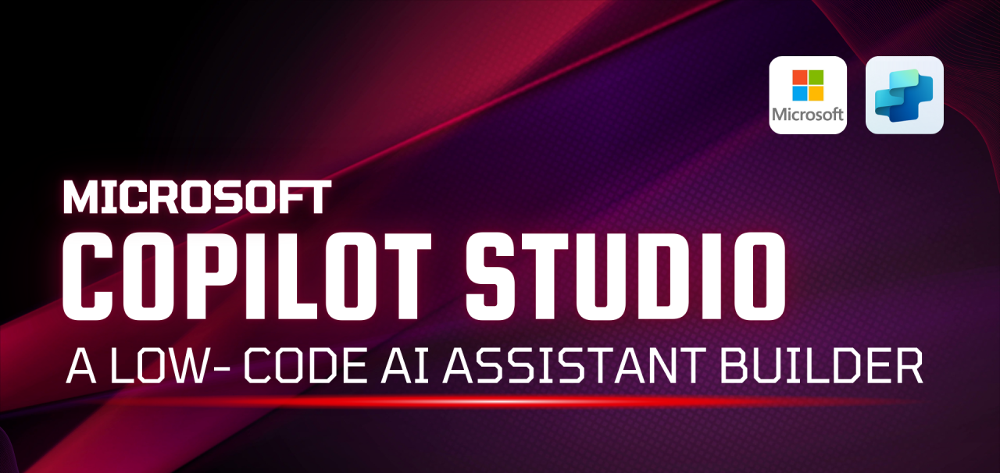
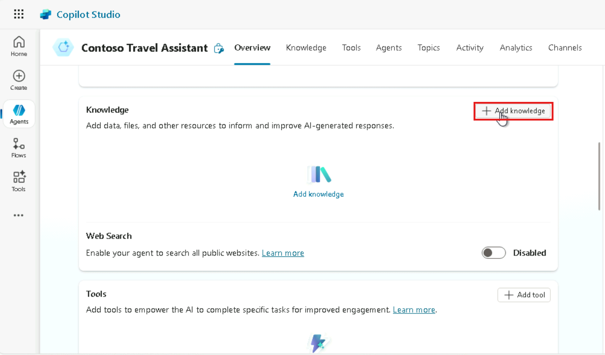
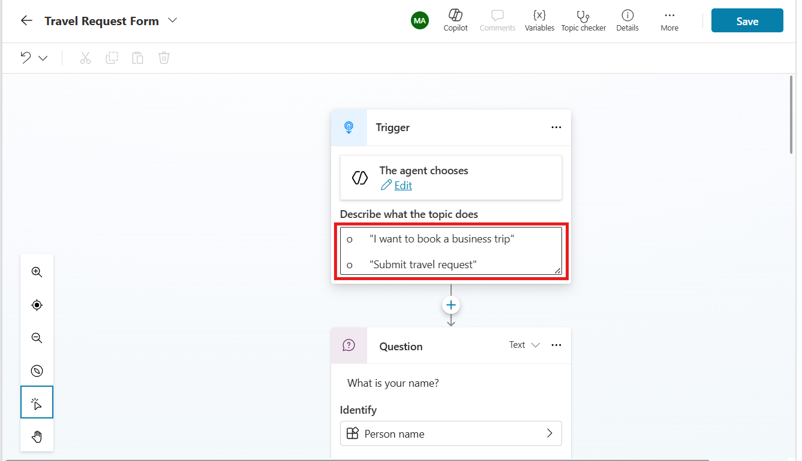

# **Project 4: Travel Request and Policy Assistant** 

*Screnario: Build Contoso Travel Assistant Travel Request and Policy
Assistant*

*Version: 25 June, 2025  
Estimated Time: 90 to 120 mins  
Platform: Microsoft Copilot Studio + Power Automate +
SharePoint/Outlook*

# Introduction

The **Travel Request and Policy Assistant** project is designed to
streamline corporate travel management using Microsoft Copilot Studio,
Power Automate, and SharePoint/Outlook. In this intermediate-to-advanced
lab, you will build an AI-powered agent for **Contoso Enterprise's
Travel Desk** to automate travel request intake, approval workflows, and
compliance support.

By the end of the project, you will create a conversational assistant
that answers policy-related questions, captures structured travel
request data, routes it for approval using Power Automate, and securely
logs all submissions for auditing via SharePoint. This solution reduces
manual errors, improves policy compliance, and boosts efficiency across
the enterprise.

# Objectives

- Build a Travel Request Assistant using Copilot Studio.

- Upload travel policy as a knowledge source for Q&A.

- Collect structured data from employees for travel bookings.

- Send travel requests to HR via Power Automate.

- Send confirmation emails and log entries in SharePoint.

# Prerequisites

- Microsoft 365 account with Copilot Studio access

- Travel policy document (PDF/DOC)

- Power Automate and SharePoint access

- Outlook or Teams access for approvals

------------------------------------------------------------------------

# Exercise 1: Enterprise Travel Site & Data List Configuration

In this section, you will set up the Enterprise Travel SharePoint site and configure the Travel Request data list. This setup enables the Travel Assistant agent to store and manage travel requests efficiently, allowing seamless integration with the automated approval process.

## Task 1: Create SharePoint Site

1.  Open your browser and go to: <https://www.office.com>

  Copilot Studio:
  <https://copilotstudio.microsoft.com/environments/0fe56244-d1d7-efdc-9313-34edaf96940d/home>
  
  SharePoint:
  <https://m365x19277286.sharepoint.com/_layouts/15/sharepoint.aspx>

2.  Sign in with your Microsoft 365 account.

3.  In the app launcher (top-left), click **"SharePoint"**.

4.  On the SharePoint home page, click **“+ Create site**

5.  Choose the **site type**:

- **Team site** – for collaboration (recommended for Power Automate
  integration).

- **Communication site** – for publishing content (not suitable for
  lists and forms).

6.  Choose **Communication Site** for this exercise.

7.  **Configure the Communication site:**

**Site Name**: Travel Assistant Site

**Template**: Standard Communication

8.  Click Next \> select language: **English \>** click **Create**

## Task 2: Create SharePoint List 

To log travel requests or documentation entries

1.  Click on **“New” \> “List”** from the home page.

2.  Choose:

- **Blank list** (preferred)

- **From Excel** (if you're uploading data)

3.  Provide Name \> click **Create**

- **Name**: Travel Request List

## Task 3: Add columns to the Travel Request List

1.  **Add Columns to Your SharePoint list**

**Travel Request Columns list**:

[TABLE]

2.  Add Traveller Name column: rename the **Title** column as
    **Traveller** **Name**

3.  Add **Destination** column:

- **Click on** **+ Add column**, then select **Text** as the column
  type, and click **Next** to proceed.

- Enter the column name in **Create** **a column** pane and click
  **Save**

4.  Add **Start** **date** column:

- **Click on** **+ Add column**, then select **Text** as the column
  type, and click **Next** to proceed.

- Enter the name of the column **Start** **date** and click **Save**

> 
>
> 

5.  Add **End** **date** column:

- Enter the column name **End** **date** and click **Save**

- **Click on** **+ Add column**, then select **Text** as the column
  type, and click **Next** to proceed.

> 
>
> 

6.  Add **Purpose** column:

- **Click on** **+ Add column**, then select **Text** as the column
  type, and click **Next** to proceed.

- Enter the column name **Purpose** and click **Save.**

> 
>
> 

7.  Add **Budget** column:

- **Click on** **+ Add column**, then select **Text** as the column
  type, and click **Next** to proceed.

- Enter the column name **Budget** and click **Save.**

> 
>
> 

8.  Add **Manager’s** **email** column:

- **Click on** **+ Add column**, then select **Text** as the column
  type, and click **Next** to proceed.

- Enter the column name **Manager’s email** and click **Save.**

> 
>
> 

9.  Your **Travel Request List** is ready with **Traveller** **Name**,
    **Destination**, **Start** **date**, **End** **date**, **Budget**,
    **Purpose** and **Manager’s** **email** columns

## Task 4: Create Agent and Add Knowledge Base to the Agent

Create a new Copilot agent and connect a knowledge base so it can
respond with relevant information from your documents or sites.

1.  **Go to [Microsoft Copilot
    Studio](https://copilotstudio.microsoft.com)** and sign in with your
    Microsoft 365 account admin credentials.

**Note:** Sign in using your own account credentials to proceed.

**Note:** Using the **Dev One** environment is recommended, but users
may proceed with the **Default** environment if needed.

2.  Click **+ New Agent \>** click **Skip to Configure,** enter all
    necessary details and click **Create**

- **Name it:** Contoso Travel Assistant

- **Description:** The Contoso Travel Assistant Agent is built in
  Microsoft Copilot Studio to streamline the internal business travel
  process for Contoso employees.

- The agent helps users understand complex travel policies by answering
  natural language questions based on uploaded policy documents. It also
  collects structured travel request data through a guided conversation
  and triggers automated workflows via Power Automate for approvals and
  logging. This reduces manual work for the HR and Admin teams and
  ensures compliance with company travel guidelines**.**

3.  Scroll down and navigate to **Knowledge** section in agent overview
    page

4.  Click **“Add a knowledge source”** and click on **select to browse**
    to upload a file

    - Upload your **Travel policy PDF or Word document**.

5.  Once the file is uploaded, enable file for **Q&A** and click
    **Save**

- Turn on **Orchestration** to leverage generative AI features.

- Set **Content moderation** level to **Moderate**

> 
>
> 

6.  Click “**Test** ” on the top right corner of the window and prompt a
    question:

- “What is the flight class limit for domestic travel?”

- “Can I book my own flight and hotel?”

- Are personal side trips allowed during business travel?

✅ **Checkpoint**: If the answers are correct, your policy Q&A is
working.

------------------------------------------------------------------------

## Task 5: Create a Topic – “Travel Request Form”

Create a conversation form to collect travel request details.

1.  In Copilot Studio agent overview page, go to **Topics** section and
    click **“+ Add a topic”** select “**From blank”**

2.  **Name the topic:** Travel Request Form

- **Description:** Click on **Describe what the topics does** message
  box and add the following phrase:

  1.  "I want to book a business trip"

  2.  "Submit travel request"

- Click **Create**

3.  Add Trigger Phrases:

- Click on **Describe what the topics does** message box and add the
  following phrase:

  - "I want to book a business trip"

  - "Submit travel request"

4.  Add **Question nodes** to collect traveller details

5.  Question node 1:

**Question**: What is your name?

**Identify** **as**: User’s entire response

**Variable**: name

> 

6.  Click on {x} var 1 and set it to: **{x} name string**

> 

7.  Question node 2:

**Question**: What is your travel destination?

**Identify** **as**: User’s entire response

**Variable**: Destination

8.  Question node 3:

**Question**: What does your travel start date ?

**Identify** **as**: User’s entire response

**Variable**: startDate

9.  Question node 4:

**Question**: What is your travel end date?

**Identify** as: User's entire response?

**Variable**: endDate

10. Question node 5:

11. **Question**: What is the purpose of your Travel?

**Identify as**: User’s entire response

**Variable**: purpose

12. Question node 6:

**Question**: What is the estimated budget of your travel?

**Identify** as: User’s entire response

**Variable**: budget

13. Question node 7:

**Question**: What is your manager’s email for approval?

**Identify** **as**: User’s entire response

**Variable**: email

14. Add a closing **Message** node and map the dynamic variable to each
    parameter to get the summary

**Message:** Thank you for providing the travel summary

**Traveller name**: {x} name string

**Destination**: {x} destination string

**Start** **Date**: {x} startDate string

**End date**: {x} endDate string

**Purpose**: {x} purpose string

**Manager’s** **email**: {x} email string

## Task 6: Customise Conversation Start Topic 

1.  Go to **Topics** section from agent overview page, navigate to
    **Systems** tab and select **Conversation Start** topic and
    customise

2.  Update the given message in the message node: Hello I am **{x}
    Bot.name|string,** a virtual Assistant.

How can I help you today?

✅ **Checkpoint**: Click “Test copilot” → Say “I want to book a business
trip” → Answer each question → Confirm all data is collected.

# Exercise 2: Create the Power Automate Flow

In this step, you will create a Power Automate flow that connects the
Travel Assistant agent to backend processes. This flow will handle user
inputs, send approval emails, and log travel requests to the SharePoint
list, enabling smooth automation of the travel request workflow.

## Task 1: Create the Agent Flow 

1.  Go to agent overview page of **Contoso Travel Assistant**, navigate
    to **Flows tab and** click **+New agent flow** to create instant
    cloud flow

2.  Click on Add a trigger node and add **when agent calls the flow**
    trigger

- When you add the **agent calls the flow** trigger, it sends user input
  (like travel request details) from the **chat** to **Power Automate**.

- This trigger starts the flow, which processes the data—such as storing
  it in SharePoint or sending it for approval.

3.  Click on **When an agent calls the flow trigger** to configure

4.  Click **+ Add an input** to map the input parameters to the flow

3.  Choose the type of user input,

[TABLE]

5.  Add **Create item** action to the flow

> In this step, you'll add the **Create item** action to store the
> agent's form data into a SharePoint list.

4.  Configure the **Create item** trigger

- **Site Address**: Travel Assistant site

- **List Name**: Travel Request List

- Map dynamic variables to each parameter:

  - Title: /Name

  - Destination: / destination

  - Start date: / startDate

  - End date: / endDate

  - Purpose: / purpose

  - Budget: / Budget

  - Manager email: /Email

**Tip**: Use the lightning bolt icon to select a dynamic variable name.

6.  Add **start and wait for an approval** trigger, to send a travel
    request approval to a manager or approver before proceeding further.

7.  Click on + sign add an action node, search and select **Start and
    wait for an approval** action

8.  Create “**Create** **new”** button to establish the c**onnection**
    with **Start and wait for an approval** action

9.  Configure **Start and wait for an approval** action

- **Approval Type**: Approve/reject first to respond

- **Title**: Approve the travel expense approval request

- **Assigned to**: MOD Administrator

> **Note:** Use your own sign-in credentials when entering approver
> details, not the MOD Admin account.

- **Details**: provide traveller name, destination, start and end dates,
  budget

10. **Add Conditions:**

> After start and wait for an approval trigger, click on add action
> **+** sign node to add conditions:
>
> The **Conditions** trigger checks the **response from the approver**:

- If the approval outcome is **"Approve"**, the flow follows the
  **True** path (e.g., log data, send confirmation).

- If the outcome is **"Reject"**, the flow follows the **False** path
  (e.g., send rejection notice, stop the process).

11. Click on **Conditions** trigger to set the conditional expressions:

> **Condition expression:**

- Outcome is equal to Approve (Add **Outcome** from **Dynamic
  content**.)

12. In the **True** branch, click **Add an action**.

13. Search and select **Send an email (V2)** action

 

14. In the Send an email (V2) step, enter the following information.

- **To** – Add **Email-ID** from Dynamic content (MOD Admin)

> **Note:** Use your own sign-in credentials when entering approver
> details, not the MOD Admin account.

- **Subject** - Expense request approved

- **Body** -

> **Hello /Traveller name**
>
> Congratulations, your Travel request is Approved.
>
> Traveller Name: /Name
>
> Destination: /Destination
>
> Travel dates: /Start date to /End date
>
> Purpose: /purpose
>
> Budget: /Budget
>
> Manager's email: /email
>
> **Thank you,**
>
> **Contoso Travel Assitant Team**

**Note:** Map the dynamic variable for each body input

> 

15. Similarly, add **Send an email** **(V2)** trigger after the
    **False** branch of the condition node

16. Click on **add an action** + sign \> select **Send an email(V2)**
    trigger

17. Configure **Send an email trigger** for **False** branch of the
    condition

> Enter the following information:

- **To** – Add **Email-ID** from Dynamic content (MOD Admin)

> **Note:** Use your own sign-in credentials when entering approver
> details, not the MOD Admin account.

- **Subject** – Travel request rejected

- **Body** –

> Hello /Traveller name
>
> ❌ We regret to inform you that your travel request has been rejected.
>
> If you have any questions or would like to submit a revised request,
> please contact your manager /Manager’s email
>
> **Thank you,**
>
> **Contoso Travel Assistant Team**

18. Once the flow is ready click on **Save draft** on the top right
    corner \> **Publish** and **Test** the Flow

19. Go to the **overview page** of the flow titled **Untitled** flow:

- Click **the Edit button** at the centre of the **Untitled** flow
  overview page, rename the flow **to Travel** **Request** **Flow**, and
  click **Save** to apply the changes.

## Task 3: Test the Travel Request Flow

20. Click on **Run** button from Travel Request Flow overview page and
    enter the details in the form

21. Enter all required traveller details and click **Run flow**

22. Please check the Outlook inbox of the account you're currently
    signed in with, for the approval email.

23. Click **Approve** to trigger the approval manager’s email**,** enter
    the **Comment** and click **submit**

- **Comment**: Approved

24. Also, verify the input logged in the SharePoint **Travel Request
    List** of **Travel Assistant site**

> 

25. Similarly, click Reject to trigger the rejection email and verify
    the Outlook account SharePoint site for the entry.

✅ **Checkpoint**: You now have a working flow to receive data and
process it.

------------------------------------------------------------------------

# Exercise 3: Add Flow to Copilot Studio agent

## In this step, you’ll connect the Power Automate flow you created to your **Copilot Studio agent**. This allows the agent to trigger the flow during conversations, enabling it to process travel requests, send approvals, and log data in SharePoint automatically. 

## Task 1: Integrate Travel Request Flow into Travel Request Form

1.  From Copilot Studio Agent overview page navigate to **Topics
    section** \> select **Tavel Request Form** topic created

2.  After manager’s email question node add the plugin that triggers the
    Travel Request Flow

3.  Click **+ Add node**, choose **Add a tool**, and then select the
    flow named **Travel Request Flow**

4.  Next, configure the required variables for the **Travel Request
    Flow** by selecting each parameter using the custom variables and
    click **Save**

**Note:** To select a custom variable, click the **three dots (…)** on
the variable box and choose the appropriate variable from the **Custom**
menu.

26. Click **Save** to save all the configurations to the **Travel
    Request Form** topic

## Task 2: Manage your connections

Before testing or running your agent and flow, ensure that all necessary
connections—like SharePoint, Outlook, and Power Automate—are properly
authenticated. Managing your connections ensures the agent can securely
access required services and complete tasks without errors.

1.  Go to the Contoso Travel Assistant overview page \> click on three
    dots (…) icon of **Test your agent** panel and click **Manage
    connections**

2.  Select the **Power automate Travel request Flow** and click on
    **Connect** if not connected

3.  Click **Submit** to connect all the tools:

- SharePoint

- Standard approvals

- Office 365 Outlook

**Note: check mark on each tool** says your flow is linked to 3 tool
nodes in different topics.

Please note that, if your flow is not connected the Copilot studio
agent, you may encounter the connection error

## Task 3: Test the Full Experience

Now that your Copilot agent, Power Automate flow, and connections are
all configured, it's time to test the complete user journey. Interact
with your agent in Microsoft Teams or the web chat to ensure it collects
input, triggers the flow, sends approval emails, and logs data in
SharePoint as expected.

1.  Use the Test Bot to:

- Ask a **policy question** “Are personal side trips allowed during
  business travel?” and validate Q&A

- Ask: What documents are required for reimbursement? And validate the
  Q&A

**Check the flow for Approval:**

2.  **Prompt**: **submit travel request** and fill the details

3.  Successful run must log all the user input into the Travel Request
    List of SharePoint site

4.  Please check the Outlook inbox of the account you're currently
    signed in with, for the approval email. "Click **Approve** button to
    approve the travel request submitted

5.  Validate the approval email triggered

6.  You can see the confirmation status on top

**Check the flow for travel request rejection:**

1.  Enter the traveller details and click **Run** **flow**

2.  Please check the **Outlook** inbox of the account you're currently
    signed in with, for the approval email.

3.  Click **Reject** button to approve the travel request submitted.

4.  Click on **Reject** button to cancel the approval request

5.  Verify the rejection email triggered

6.  You can see the **Travel Request Rejected** confirmation message on
    top:

------------------------------------------------------------------------

# Key Definitions

1.  Trigger

A **trigger** is an event that starts a workflow or process.  
In this project, the trigger is initiated when a user submits a **travel
request form** through the **Copilot Studio agent**. This sends the
request data to Power Automate, where the flow begins execution.

**Example:**

“When a Power Virtual Agents (Copilot Studio) topic sends a request to
Power Automate.”

------------------------------------------------------------------------

2.  Tool

A **tool** in Microsoft Copilot Studio refers to external integrations
or flows added to an agent topic.  
These are typically **Power Automate flows** that the agent can invoke
to perform backend operations like sending an approval email or logging
data to SharePoint.

**Example:**

“Call a tool” → Select the Power Automate flow named
**TravelRequestsApprovalFlow** to process and log the request.

------------------------------------------------------------------------

3.  Action

An **action** is an individual step within a Power Automate flow that
performs a specific function.  
Actions execute tasks such as **sending an email**, **creating a
SharePoint list item**, or **posting a Teams message** based on data
passed from the agent.

**Examples of actions in this project:**

- **“Send an email (V2)”** – Notifies the travel approver.

- **“Create item”** – Stores travel request data in a SharePoint list.

**“Get response details”** – Extracts information from the Copilot
Studio form submission

# Conclusion: Contoso Travel Assistant

The **Contoso Travel Assistant** project demonstrates a successful
implementation of a virtual travel support agent using **Microsoft
Copilot Studio**, **Power Automate**, and **SharePoint**. This
intelligent assistant streamlines the travel request workflow by
allowing employees to submit travel plans, triggering an approval
process, and recording requests in a structured, centralized SharePoint
list.

Through seamless integration:

- Employees can interact conversationally with the assistant to submit
  travel details.

- Managers receive and act on automated approval workflows via email.

- Travel records are stored and managed digitally, improving
  traceability and reducing administrative overhead.

The project highlights how **low-code/no-code tools** can be leveraged
to automate enterprise business processes with minimal technical
complexity while maintaining scalability and governance.

This solution improves efficiency, enforces travel policy compliance,
and enhances the employee experience across the enterprise.
