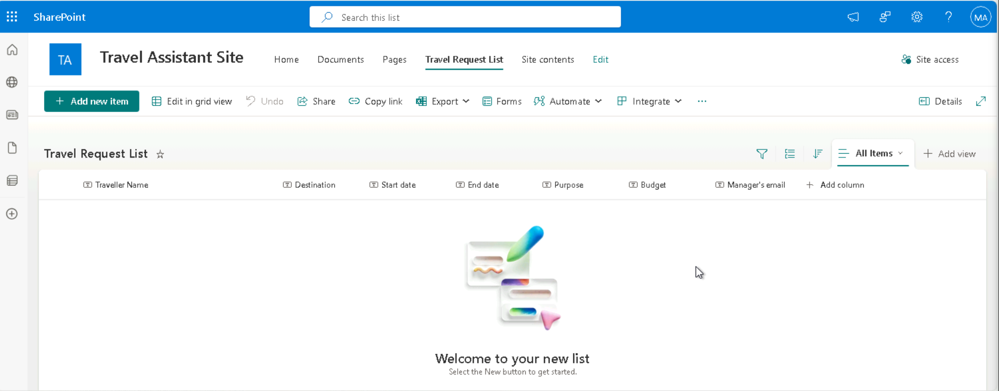

# **Project 4: Travel Request and Policy Assistant** 

*Screnario: Build Contoso Travel Assistant Travel Request and Policy
Assistant*
*Version: 25 June, 2025  
Estimated Time: 90 to 120 mins  
Platform: Microsoft Copilot Studio + Power Automate +
SharePoint/Outlook*

# Introduction

The **Travel Request and Policy Assistant** project is designed to
streamline corporate travel management using Microsoft Copilot Studio,
Power Automate, and SharePoint/Outlook. In this intermediate-to-advanced
lab, you will build an AI-powered agent for **Contoso Enterprise's
Travel Desk** to automate travel request intake, approval workflows, and
compliance support.

By the end of the project, you will create a conversational assistant
that answers policy-related questions, captures structured travel
request data, routes it for approval using Power Automate, and securely
logs all submissions for auditing via SharePoint. This solution reduces
manual errors, improves policy compliance, and boosts efficiency across
the enterprise.

# Objectives

- Build a Travel Request Assistant using Copilot Studio.

- Upload travel policy as a knowledge source for Q&A.

- Collect structured data from employees for travel bookings.

- Send travel requests to HR via Power Automate.

- Send confirmation emails and log entries in SharePoint.

# Prerequisites

- Microsoft 365 account with Copilot Studio access

- Travel policy document (PDF/DOC)

- Power Automate and SharePoint access

- Outlook or Teams access for approvals

------------------------------------------------------------------------

# Exercise 1: Enterprise Travel Site & Data List Configuration

**Goal:** Let your Copilot answer travel policy questions using a
document (PDF/DOC).

## Task 1: Create SharePoint Site

1.  Open your browser and go to: <https://www.office.com>

2.  Sign in with your Microsoft 365 account.

3.  In the app launcher (top-left), click **"SharePoint"**.

4.  On the SharePoint home page, click **“+ Create site**

5.  Choose the **site type**:

- **Team site** – for collaboration (recommended for Power Automate
  integration).

- **Communication site** – for publishing content (not suitable for
  lists and forms).

6.  Choose **Communication Site** for this exercise.

7.  **Configure the Communication site:**

**Site Name**: Travel Assistant Site

**Template**: Standard Communication

8.  Click Next \> select Language: **English \>** click **Create**

## Task 2: Create SharePoint List 

Goal: To store travel requests or knowledge base entries

1.  Click on **“New” \> “List”** from the home page.

2.  Choose:

- **Blank list** (preferred)

- **From Excel** (if you're uploading data)

3.  Provide Name \> click **Create**

- **Name**: Travel Request List

## Task 3: Add columns to the Travel Request List

1.  **Add Columns to Your List**

**Travel Request List**:

[TABLE]

2.  Traveller Name:

3.  Destination column

4.  Start Date column

> 

5.  End Date column

> 

6.  Purpose Column

> 

7.  Budget Column

> 

8.  Manager’s email

> 

9.  **Travel Request List**

## Task 4: create knowledge base

1.  **Go to [Microsoft Copilot
    Studio](https://copilotstudio.microsoft.com)** and sign in with your
    Microsoft 365 account.

2.  Click **“+ New Agent”**.

- **Name it:** Contoso Travel Assistant

- **Description:** The Contoso Travel Assistant Agent is built in
  Microsoft Copilot Studio to streamline the internal business travel
  process for Contoso employees.

- The agent helps users understand complex travel policies by answering
  natural language questions based on uploaded policy documents. It also
  collects structured travel request data through a guided conversation
  and triggers automated workflows via Power Automate for approvals and
  logging. This reduces manual work for the HR and Admin teams and
  ensures compliance with company travel guidelines**.**

- Click **“Create”**

3.  Click **Knowledge** in the top menu.

4.  Click **“Add a knowledge source” → “Upload a file”**

    - Upload your **Travel policy PDF or Word document**.

5.  After upload, **enable Q&A**.

> 
>
> 

6.  Click “**Test Copilot**” and ask questions like:

- “What is the flight class limit for domestic travel?”

- “Can I book my own flight and hotel?”

- Are personal side trips allowed during business travel?

✅ **Checkpoint**: If the answers are correct, your policy Q&A is
working.

------------------------------------------------------------------------

## Task 5: Create a Topic – “Travel Request Form”

**Goal:** Create a conversation form to collect travel request details.

1.  In Copilot Studio, go to **Topics** \> Click **“+ Add a topic” \>**
    select **From blank**

2.  **Name the topic:** Travel Request Form

> **Description:** The **Travel Request Form** topic is designed to
> collect structured travel booking details from employees through a
> conversational experience in Microsoft Copilot Studio. When a user
> expresses the intent to book a business trip, this topic is triggered
> and guides them step-by-step to provide all required information such
> as traveller name, destination, travel dates, purpose, estimated
> budget, and the manager’s email for approval.

3.  Click **Create**

4.  Add Trigger Phrases:

> Click on **Describe what the topics does** message box and add the
> following phrase:

1.  "I want to book a business trip"

2.  "Submit travel request"

5.  Add **Question nodes** to collect traveller details

**Question**: What is your name?

**Identify** **as**: User’s entire response

**Variable**: name

> 

6.  Click on {x} var 1 and set it to: **{x} name string**

7.  Add a question node:

8.  **Question**: What is your travel destination?

**Identify** **as**: User’s entire response

9.  **Question**: What is your Travel Start Date ?

**Identify** **as**: User’s entire response

10. **Question**: What is your travel end date?

**Identify** as: User's entire response?

11. **Question**: What is the purpose of your Travel?

**Identify as**: User’s entire response

12. **Question**: What is the estimated budget of your travel?

**Identify** as: Number

13. **Question**: What is your manager’s email for approval?

**Identify** **as**: User’s entire response

14. Add a closing Message node and map the variable to get the summary

**Message:** Thank you for providing the travel summary

**Traveller name**: {x} name string

**Destination**: {x} destination string

**Start** **Date**: {x} startDate string

**End date**: {x} endDate string

**Purpose**: {x} purpose string

**Manager’s** **email**: {x} email string

✅ **Checkpoint**: Click “Test copilot” → Say “I want to book a business
trip” → Answer each question → Confirm all data is collected.

------------------------------------------------------------------------

# Exercise 2: Create the Power Automate Flow

**Goal:** log the form data to SharePoint + trigger approval email.

## Task 1: Add Conversation Start Topic 

1.  Go to **Topics** \> **Systems** \> select **Conversation Start**
    topic and customise

2.  Update the message as Hello I am **{x} Bot.name|string,** a virtual
    Assistant.

How can I help you today?

## Task 2: Create the Agent Flow 

1.  Go to agent overview page of **Contoso Travel Asssistant**, navigate
    to **Flows \>** click **+New agent flow**

2.  Add **when agent calls the flow** trigger

When you add the **agent calls the flow** trigger, it sends user input
(like travel request details) from the **chat** to **Power Automate**.

This trigger starts the flow, which processes the data—such as storing
it in SharePoint or sending it for approval.

3.  Click **+ Add an input** to map the input parameters to the flow

3.  Choose the type of user input,

[TABLE]

4.  Add **Create item** action to the flow

> In this step, you'll add the **Create item** action to store the
> agent's form data into a SharePoint list.

4.  Configure the **Create item** trigger

- **Site Address**: Travel Assistant site

- **List Name**: Travel Request List

- Map dynamic variables to each parameter:

  - Title: /Name

  - Destination: / destination

  - Start date: / startDate

  - End date: / endDate

  - Purpose: / purpose

  - Budget: / Budget

  - Manager email: /Email

**Tip**: Use the lightning bolt icon to select a dynamic variable name.

5.  Add start and wait for an approval action

6.  Click on + add an action node \> search and select **Start and wait
    for an approval** action

7.  Configure Start and wait for an approval action

**Approval Type**: Approve/reject first to respond

**Title**: Approve the travel expense approval request

**Assigned to**: MOD Administrator

**Details**: provide traveller name, destination, start and end dates,
budget

8.  **Add Conditions:**

> After start and wait for an approval trigger, click on add action +
> node to add conditions

9.  Click on Conditions trigger to set the conditional expressions:

> **Condition expression:**

- Outcome is equal to Approve (Add **Outcome** from **Dynamic
  content**.)

10. In the **True** branch, click **Add an action**.

11. Search select **Send an email (V2)** action

 

12. In the Send an email (V2) step, enter the following information.

- **To** – Add **Email-ID** from Dynamic content (MOD Admin)

- **Subject** - Expense request approved

- **Body** - Your travel request is approved.

> **Hello /Traveller name**
>
> Congratulations, your Travel request is Approved.
>
> Traveller Name:
>
> Destination:
>
> Travel dates:
>
> Purpose:
>
> Budget:
>
> Manager's email:
>
> **Thank you,**
>
> **Contoso Travel Assitant Team**

**Note: Map the dynamic variable for each body input**

> 

13. Similarly, add Send an email action for the False branch of the
    condition node

14. Click on **add an action** + sign \> select **Send an email**
    trigger

15. Configure **Send an email trigger** for **False** branch of the
    condition

> Enter the following information:

- **To** – Add **Email-ID** from Dynamic content (MOD Admin)

- **Subject** – Travel request rejected

- **Body** –

> Hello /Traveller name
>
> ❌ We regret to inform you that your travel request has been rejected.
>
> If you have any questions or would like to submit a revised request,
> please contact your manager /Manager’s email
>
> **Thank you,**
>
> **Contoso Travel Assistant Team**
>
> 

16. Once the flow is ready click on **Save draft** on the top right
    corner \> **Publish** and **Test** the Flow

## Task 3: Test the Travel Request Flow

1.  Click on **Test** \> test the flow **Manually**

2.  Enter all the Traveller details and **Run the flow**

17. You will see the email triggered for Manger’s Approval

18. Click **Approve \>** enter the comment \> click **submit**

19. Also, the input logged in the SharePoint **Travel Request List** of
    **Travel Assistant site**

> 

20. **Rename** the flow**:** go to **overview** page of untitled flow \>
    click **Edit**

21. Rename the flow as: **Travel Request Flow** \> click **save**

✅ **Checkpoint**: You now have a working flow to receive data and
process it.

------------------------------------------------------------------------

# Exercise 3: Add Flow to Copilot Studio agent

**Goal:** Send the form inputs from the agent to your Power Automate
flow.

## Task 1: Integrate Travel Request Flow into Travel Request Form

1.  In Copilot Studio, go to **Topics** \> select **Tavel Request Form**
    topic

2.  After the manager’s email question node and the plugin that triggers
    the flow

3.  Click **+ Add node**, choose **Add a tool**, and then select the
    flow named **Travel Request Flow**

4.  Next, configure the required variables for the
    TravelRequestsApproval flow by selecting each one using the custom
    variables

5.  Also, add the **Travel Request Flow** to the Contoso Travel
    Assistant agent

6.  Go to overview page \> navigate to **Tools** \> click +Add tool

7.  Select the flow listed under Flows: **Travel Request Flow**

## Task 2: Manage your connections

**Goal: Manage your connections** page in Microsoft Copilot Studio, and
your **Power Automate flow ("Travel Request Flow") is successfully
connected**

1.  Go to the Contoso Travel Assistant overview page \> click on three
    dots of Test your agent section

2.  Select **Manage connections \> Refresh the page**

3.  Select the **Travel request Flow** and click on **Connect** if not
    connected

4.  Ensure all the tools are connected

**Note: check mark on each tool** says your flow is already linked to 3
tool nodes in different topics.

If your flow is not connected the Copilot studio agent you may encounter
the connection error

Click open connection manager to connect the flow

## Task 3: Test the Full Experience

1.  Use the Test Bot to:

- Ask a **policy question** “Are personal side trips allowed during
  business travel?” and validate Q&A

- What documents are required for reimbursement?

**Check the flow for Approval:**

2.  **Prompt**: **submit travel request** and fill the details

3.  Successful run must log all the user input into the Travel Request
    List of SharePoint site

4.  Check your MOD Admin Outlook inbox for the email received for
    approval

5.  Click **Approve** button to approve the travel request submitted

6.  Validate the approval email triggered

7.  You can see the confirmation status on top

**Check the flow for travel request rejection:**

1.  Enter the traveller details

2.  Open the **Outlook** and check the approval email triggered

3.  Click on **Reject** button to cancel the approval

4.  Verify the rejection email triggered

5.  You can see the confirmation message on top

------------------------------------------------------------------------

# Final Checklist:

- Copilot agent created and deployed

- Policy uploaded and enabled

- Travel form collects all required data

- Power Automate receives and processes data

- Email alerts and SharePoint logging work

- Tested end-to-end successfully

# Key Definitions

1.  Trigger

A **trigger** is an event that starts a workflow or process.  
In this project, the trigger is initiated when a user submits a **travel
request form** through the **Copilot Studio agent**. This sends the
request data to Power Automate, where the flow begins execution.

**Example:**

“When a Power Virtual Agents (Copilot Studio) topic sends a request to
Power Automate.”

------------------------------------------------------------------------

2.  Tool

A **tool** in Microsoft Copilot Studio refers to external integrations
or flows added to an agent topic.  
These are typically **Power Automate flows** that the agent can invoke
to perform backend operations like sending an approval email or logging
data to SharePoint.

**Example:**

“Call a tool” → Select the Power Automate flow named
**TravelRequestsApprovalFlow** to process and log the request.

------------------------------------------------------------------------

3.  Action

An **action** is an individual step within a Power Automate flow that
performs a specific function.  
Actions execute tasks such as **sending an email**, **creating a
SharePoint list item**, or **posting a Teams message** based on data
passed from the agent.

**Examples of actions in this project:**

- **“Send an email (V2)”** – Notifies the travel approver.

- **“Create item”** – Stores travel request data in a SharePoint list.

**“Get response details”** – Extracts information from the Copilot
Studio form submission

# Conclusion: Contoso Travel Assistant

The **Contoso Travel Assistant** project demonstrates a successful
implementation of a virtual travel support agent using **Microsoft
Copilot Studio**, **Power Automate**, and **SharePoint**. This
intelligent assistant streamlines the travel request workflow by
allowing employees to submit travel plans, triggering an approval
process, and recording requests in a structured, centralized SharePoint
list.

Through seamless integration:

- Employees can interact conversationally with the assistant to submit
  travel details.

- Managers receive and act on automated approval workflows via email.

- Travel records are stored and managed digitally, improving
  traceability and reducing administrative overhead.

The project highlights how **low-code/no-code tools** can be leveraged
to automate enterprise business processes with minimal technical
complexity while maintaining scalability and governance.

This solution improves efficiency, enforces travel policy compliance,
and enhances the employee experience across the enterprise.
